# CLAUDE.md

This file provides guidance to Claude Code (claude.ai/code) when working with code in this repository.

## Overview

**おぼえトレ**（npmパッケージ名は`gyaku-fukushou-app`のまま。旧名称「逆復唱トレーニング」からのリブランディングだが、localStorageキー接頭辞・パッケージ名は既存ユーザーのデータ互換性維持のため変更していない）は、ワーキングメモリ（作業記憶）を鍛えるトレーニングアプリ。「ことば」「すうじ（逆から入力）」「すうじ（合計を入力）」「Nバック」「デュアルNバック」「空間」「変化検出」「音・色」「ランダム」の9モードを提供する（すうじモードはホーム画面上で2つの独立したモードカードとして提供される）。UIは日本語/英語の2言語に対応（設定画面でいつでも切り替え可能、詳細は「多言語化（i18n）」セクションを参照）。トレーニング機能自体はバックエンドを持たないSPAで、全データはブラウザの`localStorage`に保存する。**例外として、オプトインの「リマインド通知」機能のみ、Vercel Serverless Functions + Redisストレージを使う最小限のバックエンドを持つ**（詳細は「プッシュ通知リマインダー」セクションを参照）。全モード共通で経験値・プレイヤーレベル・今日のミッションといったゲーミフィケーション要素を持つ（詳細は「経験値・プレイヤーレベルシステム」「今日のミッション」セクションを参照）。PWA対応でホーム画面に追加してネイティブアプリ風に利用可能。デプロイ先: https://oboetore.vercel.app/

## 応答言語

Claude Codeがこのリポジトリで作業する際の、ツール呼び出し前後に表示する一言コメント・進捗報告・要約・最終レポートなど、ユーザーに見えるテキストはすべて日本語で書くこと。英語のまま出力してよいのは、コード自体・コミットメッセージ中のコード識別子・エラーメッセージの引用など、日本語に訳すと不自然または不正確になるものに限る。

## Commands

- `npm run dev` — 開発サーバー起動（ポート5174固定、`strictPort: true`）
- `npm run build` — 型チェック（`tsc -b`）後に本番ビルド（`vite build`）
- `npm run lint` — oxlint実行
- `npm run preview` — 本番ビルドのプレビュー
- `npm run test` — Vitestでロジック層のテストを実行（`environment: 'node'`）
- `npm run test:e2e` — Playwrightでブラウザ上のE2Eテストを実行（初回は`npx playwright install --with-deps chromium`が必要）

## Tech stack

| 分類 | 技術 |
|---|---|
| フレームワーク | React 19 + TypeScript |
| ビルドツール | Vite（`@vitejs/plugin-react`） |
| スタイリング | Tailwind CSS v4（`@tailwindcss/vite`、CSS-firstの`@theme`設定。`tailwind.config.js`は存在しない） |
| PWA | vite-plugin-pwa（`registerType: 'autoUpdate'`） |
| テスト | Vitest（`environment: 'node'`、ロジック層のみ対象。UIコンポーネントのテストはなし） |
| Lint | oxlint |
| 状態管理 | Reactの`useState`＋localStorage永続化のみ（外部状態管理ライブラリなし） |
| バックエンド（通知機能のみ） | Vercel Serverless Functions（`api/`配下、Node.jsランタイム）＋ Redisストレージ（`@upstash/redis`、Vercel経由）＋ Vercel Cron |

## Screen structure / navigation

`App.tsx`が`View`（Union型）でSPA内の画面状態を管理し、`window.history.pushState`/`popstate`と連動する（ブラウザの戻る操作・PWA化した際のOS標準の戻るボタンにも対応）。

```mermaid
flowchart TD
    top["top（トップ画面: ランダム/個別選択モード/今日のミッションの3ボタン）"]
    modeSelect["mode-select（個別選択モード画面、9モードカードグリッドからランダムを除く8モード）"]
    dailyMission["daily-mission（今日のミッション画面）"]
    stats["stats（統計画面）"]
    settings["settings（設定画面）"]

    wordLevel["word-level（レベル選択）"]
    wordGame["word-game（ゲーム画面）"]
    wordResult["結果表示"]

    digitLevel["digit-level（レベル選択、逆から入力/合計を入力）"]
    digitGame["digit-game（ゲーム画面）"]
    digitResult["結果表示"]

    nbackLevel["nback-level（レベル選択）"]
    nbackGame["nback-game（ゲーム画面）"]
    nbackResult["結果表示"]

    dualNbackLevel["dual-nback-level（レベル選択）"]
    dualNbackGame["dual-nback-game（ゲーム画面）"]
    dualNbackResult["結果表示"]

    top -->|📊 統計| stats
    top -->|⚙️ 設定| settings
    top -->|📋 個別選択モード| modeSelect
    top -->|🎯 今日のミッション| dailyMission
    dailyMission -->|自動選定した弱点モード・レベルへ直接| digitGame
    dailyMission -->|← ホーム| top

    modeSelect -->|ことばモード| wordLevel --> wordGame --> wordResult
    wordResult -->|同レベルで再挑戦| wordGame
    wordResult -->|戻る| wordLevel
    wordLevel -->|← モード選択| modeSelect

    modeSelect -->|すうじモード（逆から入力/合計を入力）カードから直接| digitLevel --> digitGame --> digitResult
    digitResult -->|同条件で再挑戦| digitGame
    digitResult -->|戻る| digitLevel
    digitLevel -->|← モード選択| modeSelect

    modeSelect -->|Nバックモード| nbackLevel --> nbackGame --> nbackResult
    nbackResult -->|同レベルで再挑戦| nbackGame
    nbackResult -->|戻る| nbackLevel
    nbackLevel -->|← モード選択| modeSelect

    modeSelect -->|デュアルNバックモード| dualNbackLevel --> dualNbackGame --> dualNbackResult
    dualNbackResult -->|同レベルで再挑戦| dualNbackGame
    dualNbackResult -->|戻る| dualNbackLevel
    dualNbackLevel -->|← モード選択| modeSelect

    spatialLevel["spatial-level（レベル選択）"]
    spatialGame["spatial-game（ゲーム画面）"]
    spatialResult["結果表示"]

    patternLevel["pattern-level（レベル選択）"]
    patternGame["pattern-game（ゲーム画面）"]
    patternResult["結果表示"]

    toneLevel["tone-level（レベル選択）"]
    toneGame["tone-game（ゲーム画面）"]
    toneResult["結果表示"]

    modeSelect -->|空間モード| spatialLevel --> spatialGame --> spatialResult
    spatialResult -->|同レベルで再挑戦| spatialGame
    spatialResult -->|戻る| spatialLevel
    spatialLevel -->|← モード選択| modeSelect

    modeSelect -->|変化検出モード| patternLevel --> patternGame --> patternResult
    patternResult -->|同レベルで再挑戦| patternGame
    patternResult -->|戻る| patternLevel
    patternLevel -->|← モード選択| modeSelect

    modeSelect -->|音・色モード| toneLevel --> toneGame --> toneResult
    toneResult -->|同レベルで再挑戦| toneGame
    toneResult -->|戻る| toneLevel
    toneLevel -->|← モード選択| modeSelect

    randomLevel["random-level（レベル選択、出題数・出題モード選択）"]
    randomGame["random-game（ゲーム画面）"]
    randomResult["結果表示"]

    top -->|🎲 ランダムモード| randomLevel --> randomGame --> randomResult
    randomResult -->|同レベルで再挑戦| randomGame
    randomResult -->|戻る| randomLevel
    randomLevel -->|← ホーム| top
```



- 各レベル選択・ゲーム画面には「← 戻る」ボタンがある。個別選択モード配下の各モードのレベル選択画面は「← モード選択」で`mode-select`画面へ、ランダムモードのレベル選択画面と`mode-select`/`daily-mission`画面自体は「← ホーム」で`top`へ戻る。
- 回答途中で離脱しようとすると`confirmExit`（`window.confirm`）で「回答中のセットが破棄されます。よろしいですか？」の確認ダイアログを表示する。
- 履歴を表示する画面（top / mode-select / daily-mission / word-level / digit-level / nback-level / dual-nback-level / spatial-level / pattern-level / tone-level / random-level / stats）に遷移するたびにlocalStorageの履歴を再読み込みする。
- 旧ミッション/デイリーチャレンジ/プログラムのカードをまとめて表示していた`TopEngagementChips.tsx`（ホーム画面の3ボタン化で`TopScreen.tsx`から呼び出されなくなっていた）と、その専用UIだった`DailyChallengeCard.tsx`・設定画面のチップ自動展開設定（`AppSettings.autoExpandChip`、`SettingsAutoExpandChipSection.tsx`）・チップ専用の進捗計算`src/lib/program.ts`は、いずれもどこからも参照されなくなった時点で削除した（ユーザー指示による）。`missions.ts`（[今日のミッション旧版](#今日のミッション旧版srclibmissionsts-ui非表示)）はXP付与ロジックが今も動いているため区別して残置している。

## Feature requirements

### ことばモード（`src/lib/reverse.ts`, `src/lib/kana.ts`, `src/lib/phrases.ts`, `src/lib/phraseStats.ts`）

- **多言語対応**: 日本語の音韻に強く依存するため、UI言語を英語にすると選択できなくなる（トップ画面にボタン自体が表示されない）。詳細は「多言語化（i18n）」セクションを参照。
- **出題方式**: `PHRASES`（ひらがな表記の単語・文リスト）からレベルごとに重複なく3問抽出する。等確率のランダム抽選ではなく、`src/lib/phraseStats.ts`に蓄積したフレーズ単位の正誤履歴（`localStorage`キー`gyaku-fukushou:phraseStats`）に基づく重み付き抽選（`pickQuestionSet`）。誤答が多いフレーズほどウェイトが上がり選ばれやすくなり、未挑戦のフレーズは標準ウェイトのまま（既存フレーズより優先も劣後もしない）。1問終えるたびに`recordPhraseAttempt`でそのフレーズの正誤を記録する。ことばモードはフレーズという固定候補プールを持つためこの方式が使えるが、他4モード（すうじ/空間/変化検出/音・色）は固定候補プールを持たないため、代わりに系列パターンをバケット分類して重み付ける方式を使う（[出題重み付け](#出題重み付けすうじ空間変化検出音色srclibquestionweightingts)参照）。
- **レベル定義**:
  | レベル | 文字数 | 収録語数 | 復唱の持ち時間 | 一致許容編集距離 |
  |---|---|---|---|---|
  | 1 | 2〜4文字（例: かさ、りんご） | 66語 | 4秒 | 1 |
  | 2 | 4〜6文字（例: ひまわり、とうもろこし） | 68語 | 5秒 | 1 |
  | 3 | 6〜8文字（例: がっこうにいく） | 39語 | 6秒 | 2 |
- **1問の流れ**（`reading → repeat → listening → result`）:
  1. `reading`: 音声合成（Web Speech API）で読み上げ。非対応ブラウザではテキスト表示にフォールバック。
  2. `repeat`: レベル別秒数のカウントダウン中に、逆から声に出して復唱。
  3. `listening`: 音声認識（Web Speech API、`lang: 'ja-JP'`、最大5候補）で聞き取り。タイムアウトはベース4000ms＋文字数×700ms。
  4. `result`: 正誤判定・結果表示。
- **正誤判定**: 期待する答えは文字列をコードポイント単位で反転したもの。認識結果の候補群を正規化（空白・句読点除去＋カタカナ→ひらがな変換）した上でレーベンシュタイン距離が許容値以内なら正解。
- ユーザーが誤判定を手動で反転できる「実際は不正解/正解だった場合はこちら」ボタンあり。認識結果が空の場合は「もう一度録音する」で再収音可能。
- マイクエラー（`not-allowed`, `service-not-allowed`, `audio-capture`）ごとに専用メッセージを表示。
- 音声認識非対応ブラウザでは、レベル選択画面に警告バナーを表示しレベル選択ボタンを無効化。

### すうじモード（`src/lib/digits.ts`）

- ホーム画面では「すうじモード（逆から入力）」「すうじモード（合計を入力）」の2枚の独立したモードカードとして提供する（内部的には共通の`Mode: 'digit'`＋`DigitGameType: 'reverse' | 'sum'`で、カードをタップすると対応する`gameType`でレベル選択画面へ直接遷移する。かつて存在した中間選択画面`DigitTypeSelect`は廃止済み）。
- **出題方式**: レベルごとの桁数でランダムな数字列を3問生成。誤答が多い系列パターンほど選ばれやすい重み付き抽選（[出題重み付け](#出題重み付けすうじ空間変化検出音色srclibquestionweightingts)参照）。
- **レベル定義**:
  | レベル | 桁数 |
  |---|---|
  | 1 | 3桁 |
  | 2 | 5桁 |
  | 3 | 7桁 |
- **1問の流れ**（`ready → showing → answering → result`）:
  1. `ready`: 1000ms待機
  2. `showing`: 数字を1つずつ表示。1桁あたり表示700ms＋間隔250ms
  3. `answering`: テンキーUI（`NumpadInput`、物理キーボード入力も対応）で回答入力。タイムアウトはベース2000ms＋桁数×2000ms、時間切れで自動採点
  4. `result`: 正誤判定
- **正誤判定**:
  - reverse: 数字配列を逆順に文字列化したものと比較（先頭0埋めの差異は同一視、例: 「325」と「0325」）
  - sum: 数字の合計値の文字列と一致するか

### Nバックモード（`src/lib/nback.ts`）

- **出題方式**: 3×3グリッドのマスが1つずつ光る空間版Nバック課題（Kirchner 1958のspatial n-back課題を参考）。レベルに応じたN値（1back/2back/3back）で、選択した出題数分のマス位置系列を生成。N個前と一致する確率は35%で意図的に混入。
- **出題数**: レベル選択画面で10問/20問/30問から選択（既定20問）。
- **レベル定義**: レベル1=1つ前と比較、レベル2=2つ前と比較、レベル3=3つ前と比較
- **1試行の流れ**（`ready → showing → result`）:
  - `ready`: 1000ms
  - `showing`: 3×3グリッドの1マスを1800ms点灯＋400ms空白。表示中に「一致」ボタン（またはスペースキー）を押すとその試行を記録
  - 選択した出題数の試行終了後`result`へ
- **正誤判定**: シグナル検出理論に基づくスコアリング
  - hits（一致で押した）／misses（一致なのに押さなかった）／falseAlarms（不一致なのに押した）／correctRejections（不一致で押さなかった）
  - 正答率 = (hits + correctRejections) / 総試行数 × 100（四捨五入）

### デュアルNバックモード（`src/lib/dualNback.ts`）

位置（3×3グリッド）と音（8種類の合成トーン）を同時提示し、それぞれ独立に「N個前と一致するか」を判定する高難度モード。SDT（シグナル検出理論）のスコアリング関数`scoreMatchTrials`は`nback.ts`から抽出して共通化しており、Nバックモードと本モードの双方から利用する。

- **出題方式**: レベルに応じたN値（1back/2back/3back、Nバックと同じ）で、選択した出題数分の位置・音の系列を独立に生成。それぞれ一致する確率は30%で意図的に混入。
- **出題数**: レベル選択画面で10問/20問/30問から選択（既定20問、Nバックモードと同様）。
- **レベル定義**: レベル1=1つ前と比較、レベル2=2つ前と比較、レベル3=3つ前と比較
- **1試行の流れ**（`ready → showing → result`）:
  - `ready`: 1000ms
  - `showing`: 位置と音を同時に2000ms表示＋400ms空白。表示中に「位置一致」「音一致」ボタン（またはA/Lキー・矢印キー）を独立に押してその試行を記録
  - 選択した出題数の試行終了後`result`へ
- **正誤判定**: 位置・音それぞれ独立にSDTスコアリング。`HistoryEntry`には型変更なしで`correct`＝位置＋音のhit+correctRejection合計、`total`＝試行数×2として記録する（既存スキーマにそのまま収まる）。

### 空間モード（`src/lib/spatial.ts`）

視空間ワーキングメモリ（Corsi Block-Tapping Taskを参考）を鍛えるモード。マスが順番に光るのを見て覚え、逆の順番でタップして答える。

- **出題方式**: レベルごとのグリッドサイズから、重複なくランダムにマスを選んで系列を生成し、3問1セットで出題。誤答が多い系列パターン（隣接マス移動の有無）ほど選ばれやすい重み付き抽選。
- **レベル定義**:
  | レベル | グリッド | マス数 |
  |---|---|---|
  | 1 | 3×3 | 3 |
  | 2 | 3×3 | 4 |
  | 3 | 4×4 | 5 |
- **1問の流れ**（`ready → showing → answering → result`）:
  1. `ready`: 1000ms待機
  2. `showing`: マスを1つずつ光らせる。1マスあたり表示700ms＋間隔250ms
  3. `answering`: グリッドを逆の順番でタップして回答。タップ済みマスには順番の数字を表示。タイムアウトはベース3000ms＋マス数×2000ms、時間切れで自動採点
  4. `result`: 正誤判定
- **正誤判定**: タップした順序が、出題系列を逆順にしたものと完全一致するか。

### 変化検出モード（`src/lib/pattern.ts`）

視覚ワーキングメモリの再生課題（Luck & Vogel 1997の変化検出課題を参考にした再生版）を鍛えるモード。一瞬表示される模様を覚え、白紙に戻った状態から元々塗りつぶされていたマスを選び直す。

- **出題方式**: レベルごとのグリッドサイズ・塗りつぶしマス数でランダムな模様を生成。3問1セットで出題。誤答が多い模様パターン（マスのかたまり具合）ほど選ばれやすい重み付き抽選。
- **レベル定義**:
  | レベル | グリッド | 塗りつぶしマス数 |
  |---|---|---|
  | 1 | 4×4 | 4 |
  | 2 | 4×4 | 6 |
  | 3 | 5×5 | 8 |
- **1問の流れ**（`ready → showing → answering → result`）:
  1. `ready`: 1000ms待機
  2. `showing`: 模様を3000ms表示→500ms空白（全マス白に戻る）
  3. `answering`: 全マス白の状態からタップでマスをトグル選択し、「回答する」ボタンで明示的に確定。タイムアウトはベース4000ms＋塗りつぶしマス数×400ms、時間切れは現在の選択状態で自動採点
  4. `result`: 正誤判定。不正解時は正解のマス（緑）・誤選択（赤）・選び漏れ（黄）を色分け表示
- **正誤判定**: `isPatternSelectionCorrect`。選択したマス集合が元の塗りつぶしマス集合と完全一致（順不同）の場合のみ正解。1つでも過不足があれば不正解。

### 音・色モード（`src/lib/tone.ts`）

非言語性の聴覚ワーキングメモリ（ピッチ記憶が言語・数字の記憶と独立した貯蔵系であることを示すDeutsch 1970などの知見を参考）を鍛える、Simon型のモード。4色のパッドが音とともに光る順番を覚え、同じ順にタップして再現する。

- **出題方式**: レベルごとの長さで、4色のパッド番号（重複可）をランダムに並べた系列を生成。3問1セットで出題。誤答が多い系列パターン（パッドの重複有無）ほど選ばれやすい重み付き抽選。
- **レベル定義**:
  | レベル | 音数 |
  |---|---|
  | 1 | 3 |
  | 2 | 4 |
  | 3 | 5 |
- **1問の流れ**（`ready → showing → answering → result`）:
  1. `ready`: 1000ms待機
  2. `showing`: パッドを1つずつ光らせ、`playPadTone`（Web Audio API、パッドごとに異なる音高）で音を鳴らす。1パッドあたり表示600ms＋間隔300ms
  3. `answering`: 4色のパッドを同じ順にタップして回答。タイムアウトはベース3000ms＋音数×2000ms、時間切れで自動採点
  4. `result`: 正誤判定
- **正誤判定**: タップした順序が出題系列と完全一致するか。

### ランダムモード（`src/lib/random.ts`）

すうじ（逆から入力・合計を入力）・空間・変化検出・音/色の「単発質問→回答」型5候補から出題数分を集め、シャッフルした順で出題するミックス練習モード。Nバック系（連続試行方式）とことばモード（音声入出力）は構造が大きく異なるため対象外。

- **出題方式**: `buildRandomRounds(level, roundCount, options?, exclude?, enabledTypes?)`が候補ラウンド生成関数を組み立て、`roundCount`が候補数以下ならその中から重複無く`roundCount`種類を選び、候補数を超える場合（7問等）は超過分だけランダムに重複させたうえでFisher-Yatesでシャッフルする。すうじの2ラウンドは`RandomRound`型の`gameType: 'reverse' | 'sum'`で区別する。出題数は`ROUND_COUNT_OPTIONS`（3/5/7、既定5）から選べる（`RandomLevelSelect.tsx`のNバックと同様の出題数ピッカー）。
- **出題するモードの選択**: `RandomLevelSelect.tsx`で5候補（すうじ・逆から/合計/空間/変化検出/音・色）のうちどれを対象にするかトグルボタンで選べる（`RandomRoundType`、既定は全種類）。最後の1つは選択解除できない（`buildRoundGenerators`の`enabledTypes`が空配列になると出題不能になるため、UI側で最小1件を強制する二重防御）。選択状態は`View`（`App.tsx`）の`enabledTypes`として保持し、レベル選択・結果画面間の遷移をまたいで維持される。
- **1ラウンドの流れ**: 各ラウンドの出題生成・正誤判定ロジックは対応する`lib/*.ts`をそのまま呼び出す（重複実装なし）。表示・入力UIのみラウンド種別ごとに`RandomGameScreen.tsx`内で切り替える。結果フェーズの詳細表示（出題・正しい答え・自分の回答）は`RandomResultDetail.tsx`が単体モード画面と同じ内容をラウンド種別ごとに出し分ける。音・色ラウンドのパッド配色は`src/lib/tonePadStyles.ts`（`ToneGameScreen.tsx`と共有）を使う。
- **正誤判定**: 各ラウンドは元モードの判定関数（`isDigitAnswerCorrect`/`isSpatialAnswerCorrect`/`isPatternSelectionCorrect`/`isToneAnswerCorrect`）をそのまま使う。すうじ（合計）ラウンドの最大入力文字数・自動採点判定は単体のDigitGameScreenと同じ`getDigitMaxAnswerLength`相当のロジックを使う（「逆から」のみ桁数到達で自動採点、「合計」は常に決定ボタンでの明示確定）。
- `HistoryEntry`は`mode: 'random'`、`correct`＝出題数中の正解数、`total`＝出題数として記録する。`src/lib/history.ts`の`ALL_AREAS`には**含めない**（単一スキル指標ではないため、苦手分野判定・ベンチマークの対象外）。累計セット数・実績等、履歴全体を見る集計には自動的にカウントされる。
- Android実装を見据えたセッション状態復元（`src/lib/gameSessionPersistence.ts`）に対応済み。詳細は「Data model」内の「セッション状態の一時保存」を参照。

### 出題重み付け（すうじ/空間/変化検出/音・色、`src/lib/questionWeighting.ts`）

ことばモードはフレーズという固定候補プール（`PHRASES`）を持つため`phraseStats.ts`でフレーズ単位に重み付けできるが、この5モードは固定プールを持たずその場で乱数生成する方式のため、代わりに「生成した系列パターンを粗い特徴（バケット）に分類し、バケット単位の正誤統計を蓄積する」方式を取る。出題時は候補を複数（既定5件）生成し、苦手なバケットに属する候補ほど選ばれやすい重み付き抽選（`pickWeightedCandidate`）で1件を選ぶ。重み計算式（`1 + 誤答率 × 3`）はことばモードの`getPhraseWeight`と同じ考え方。

- **統計の保存**: `gyaku-fukushou:questionStats:<mode>`（`digit`/`spatial`/`pattern`/`tone`ごとに独立）に`Record<"<level>:<bucket>", { correct, total }>`形式で保存する。
- **モードごとの分類（バケット）**:
  | モード | 分類基準 | バケット |
  |---|---|---|
  | すうじ | 数字の重複有無（`classifyDigitPattern`、`digitAnswer.ts`が提供） | `repeat` / `unique` |
  | 空間 | 連続するタップ間に隣接マスへの移動があるか | `adjacent` / `scattered` |
  | 変化検出 | 塗りつぶしマスの平均マス間距離がグリッド幅の半分以下か | `clustered` / `scattered` |
  | 音・色 | パッドの重複有無 | `repeat` / `unique` |
- 各GameScreenは正誤判定の直後に`record<Mode>Attempt(level, ..., correct)`（`recordDigitAttempt`/`recordSpatialAttempt`/`recordPatternAttempt`/`recordToneAttempt`）を呼び、そのバケットの統計を更新する。ランダムモード（`RandomGameScreen.tsx`）は各`pick*QuestionSet`をそのまま呼ぶため重み付けの恩恵はそのまま受けるが、実行結果の記録（`record*Attempt`）はここでは行わない（統計は各専用モードでの挑戦から蓄積される設計）。

### 共通: レベル推奨ロジック（`src/lib/difficulty.ts`）

- 正答率100%以上 → レベルアップ提案（レベル3未満の場合）
- 正答率50%未満 → レベルダウン提案（レベル1超の場合）
- 結果画面（`SetSummary`）に「次のレベルへ挑戦」または「前のレベルに戻る」ボタンとして表示（全モード共通）

### 実績（アチーブメント）システム（`src/lib/achievements.ts`）

24種類。判定はすべて履歴データから都度動的に計算する（永続化された「解除済みフラグ」は存在しない）。プレイヤーLv系実績のみXP計算にミッション達成ログ件数が必要なため、`isUnlocked(history, missionCompletionCount?)`は第2引数を受け取る（省略時は0扱い）。

| アイコン | ラベル | 解除条件 |
|---|---|---|
| 🎉 | はじめの一歩 | 履歴が1件以上 |
| 💯 | パーフェクト | いずれかのセットで全問正解 |
| 🔥 | 3日坊主卒業 | 連続挑戦日数 ≥ 3 |
| 🔥🔥 | 継続は力なり | 連続挑戦日数 ≥ 7 |
| 🔥🔥🔥 | 猛者 | 連続挑戦日数 ≥ 30 |
| 🗣️ | ことば上級者 | ことばモードのレベル3に挑戦履歴あり |
| 🔢 | すうじ上級者 | すうじモードのレベル3に挑戦履歴あり |
| 🧠 | Nバック上級者 | Nバックモードのレベル3に挑戦履歴あり |
| 🧩 | 空間記憶上級者 | 空間モードのレベル3に挑戦履歴あり |
| 👀 | 観察力上級者 | 変化検出モードのレベル3に挑戦履歴あり |
| 🎵 | 音感上級者 | 音・色モードのレベル3に挑戦履歴あり |
| 🧠🧠 | デュアルNバック上級者 | デュアルNバックモードのレベル3に挑戦履歴あり |
| 📈 | 継続力 | 累計セット数 ≥ 10 |
| 🏆 | 継続力（上級） | 累計セット数 ≥ 50 |
| 🌱 | 成長中 | 自己比較ベンチマーク（`benchmarks.ts`）で正答率が向上中（band: 'above'）のモードが2つ以上 |
| 🌟 | オールラウンダー | word/digit/nback（従来3モード）に挑戦履歴あり（後方互換のため対象は変更していない） |
| 🌈 | 全モード制覇 | ことば・すうじ・Nバック・空間・変化検出・音の従来6モードに挑戦履歴あり（後方互換のため対象は変更していない） |
| 🌠 | コンプリート | デュアルNバック・ランダムを含む全8モード（`Mode`型の全種類）に挑戦履歴あり |
| 👑 | 全モードマスター | 全8モードでレベル3に挑戦履歴あり（個々の`level-3-*`実績を横断した集約実績） |
| 🥉 | 駆け出しトレーナー | プレイヤーLv（XPシステム）が5に到達 |
| 🥈 | 熟練トレーナー | プレイヤーLvが10に到達 |
| 🥇 | マスタートレーナー | プレイヤーLvが20に到達 |
| 🎖️ | スコアマスター | 統計画面の「トレーニングスコア」の総合スコアが80%に到達（`src/lib/trainingScore.ts`） |
| 🧭 | バランストレーナー | 数字記憶・空間記憶・注意制御の3カテゴリすべてに1回以上挑戦履歴あり |

- `isUnlocked`はhistory配列のみから解除判定を導出する設計を徹底している（`missionCompletions`のようなlocalStorageの直接参照はセット完了直後の新規解除演出で常に「解除済み」と誤判定されるため使えない。詳細は`achievements.ts`冒頭のコメント参照）。
- セット完了直前・直後の履歴を比較し、新規解除された実績を検出する（`getNewlyUnlockedAchievements`）。検出時は効果音＋結果画面に「🎉 新しい実績を獲得しました！」バッジを表示。
- 統計画面では全実績を常時コンパクトなグリッド表示し、未解除は半透明表示。見出しに「n / 全件数 解除」の解除数を表示する。各実績カードは`<button>`で、タップ（クリック）すると選択状態になりカード下にラベル・解除状況・説明文を表示するインラインの詳細パネルが開く（PCの`title`属性ホバーに加え、スマホでも詳細が確認できるようにするため）。

### 経験値・プレイヤーレベルシステム（`src/lib/xp.ts`）

全モード共通の経験値付与ルール。実績・自己ベストと同じ「履歴から動的計算」の哲学に倣い、XP専用の可変ストアは持たず`computeTotalXp(history, missionCompletionCount)`で都度計算する。

- **XP付与ルール**: 正解1問につき+10XP、1セット全問正解につきさらに+50XP、今日のミッション達成につき+100XP（達成回数は後述の`missionCompletions`ログから取得。旧ミッション`missions.ts`と新ミッション`dailyMission.ts`は同じログを`missionId`で区別しながら共有しており、どちらの達成もこのログ件数に加算される）。
- **レベル**: プレイヤーはLv1から開始し、`xpNeededToLevelUp(L) = 100 + (L-1)*50`（Lv1→2は100XP、Lv2→3は150XP、Lv3→4は200XP…と徐々に増加）の累積しきい値でレベルアップする。`getXpProgress(totalXp)`が`{level, currentLevelXp, xpToNextLevel}`を返す。
- **UI**: `useSetCompletionRecorder`がセット完了ごとに`xpGained`/`leveledUp`/`newLevel`を計算し、`SetSummary`に「獲得XP」表示とレベルアップ時の演出（既存の`playLevelUp()`効果音を流用）を追加する。ホーム画面（`TopScreen`）にプレイヤーLv・XPバー・次のレベルまでの残りXPを常時表示する。既存の各モードの「難易度レベル(Lv1〜3)」とは別概念のため、UI文言では「プレイヤーLv」として区別している。

### 今日のミッション旧版（`src/lib/missions.ts`、UI非表示）

継続利用率向上のための日替わりミニタスク。日付キー（`localDateKey`）からハッシュで決定的に1件選ぶため、選択結果自体は永続化不要（同じ日は常に同じミッションになる）。**ホーム画面の3ボタン化に伴いUIからは非表示にした（`TopScreen`に旧「🎯 今日のミッション」カードは表示しない）が、コードと`missionCompletions`ログによるXP付与ロジックはそのまま残している**（後方互換のため。ユーザーの決定により「非表示化のみ、コードは残す」方針）。新たにホーム画面から到達できるのは後述の「今日のミッション（v2）」。

- **ミッション定義**: 「(モード)を2回プレイ」×8モード分（`Mode`型の全8種類、ことばは日本語版のみ対象）＋「正答率80%以上を達成」の計9種類。プレイ回数系は`Mode`と閾値回数を持つ`{kind:'playCount', mode, count}`、正答率系は`{kind:'accuracy', percent}`という判別可能ユニオンで表現する。
- **達成判定**: `isTodayMissionComplete(history, language)`が今日の履歴に対して判定する。`checkAndRecordMissionCompletion`はセット完了時に呼ばれ、今日初めて達成した場合のみ`gyaku-fukushou:missionCompletions`（達成ログ、`{dateKey, missionId}[]`）に記録してXPボーナスを1回だけ付与する（同日内の再判定は二重付与しない）。

### 今日のミッションv2（`src/lib/dailyMission.ts`、ホーム画面から到達可能）

ホーム画面の3ボタン（[ランダムモード]／[個別選択モード]／[今日のミッション]）の1つとして提供する、弱点克服に特化した日替わりミニゲーム。旧版（`missions.ts`）とは「対象を弱点分野から自動選定する」「3セット達成が条件」という点で異なるが、XP付与の仕組み（`missionCompletions`ログ）は共有している。

- **対象の自動選定**: `getDailyMissionTarget(history, language, now)`が、過去の履歴から正答率が低いモード・レベルの組み合わせ（`{mode, level, gameType?}`）を弱点として選ぶ。選定結果は`gyaku-fukushou:dailyMissionTargets`（`{dateKey, mode, level, gameType?}[]`、最大60件）に日付キー付きで記録し、同じ日に再訪しても同じ対象を返す（選定基準はセット完了ごとに変わりうるため、当日の一貫性を保つために必要）。ことばモードは英語UIでは選定対象から除外する。
- **進捗・達成判定**: `getDailyMissionProgress(history, target, now)`が当日の対象一致セット数（`DAILY_MISSION_REQUIRED_SETS = 3`）をカウントし、`isDailyMissionComplete`が達成可否を返す。`checkAndRecordDailyMissionCompletion(historyBefore, historyAfter, target, now)`はセット完了時に呼ばれ、今日初めて3セット達成した場合のみ`missionCompletions`ログへ`missionId: DAILY_MISSION_ID`（`'daily-target'`）で記録しXPボーナスを1回だけ付与する（旧版と`missionId`で区別されるため、同日に両方が達成されればそれぞれ独立してボーナスが付く）。
- **UI**: `DailyMissionScreen.tsx`が対象モード・レベルと進捗（n/3）を表示し、「挑戦する」ボタンで対応するゲーム画面へ直接遷移する（`App.tsx`の`goToDailyMissionGame(target)`）。達成済みの場合はボタンをグレーアウトし達成済み表示に切り替える（`TopScreen`側でも達成有無に応じてホーム画面の「今日のミッション」ボタンをグレーアウトする）。

### 週間振り返りカード（`src/lib/recap.ts`）

トップ画面（`TopScreen`）に表示する、継続利用率向上のための動機付け施策。直近に完了した週（月曜〜日曜）のセット数・正答率を集計し、前々週のセット数と比較したメッセージ（増加/減少/同数）を添えて表示する（`getWeeklyRecap`）。

- その週に1件も記録がなければ何も表示しない（振り返る内容がないため）。
- 週が変わるたびに1回だけ表示する。表示済みの週キーは`localStorage`（`gyaku-fukushou:lastRecapWeekKey`）に保存し、閉じる操作（`markRecapShown`）で更新する。
- SNSシェア（「結果をシェア」機能）と相性の良い訴求内容を意図して設計。

### サプライズ演出（`src/lib/luckyBonus.ts`）

実績のような「達成すれば必ずもらえる」確定報酬とは別に、結果画面（SetSummary）表示のたびに12%の確率で「🍀 ラッキーデー！」バッジを表示する完全にランダムな演出（`rollLuckyBonus`）。実績・統計・レベル判定など、いかなる評価軸にも一切影響しない飾りの演出として意図的に設計しており、実績システムの価値を損なわない。SetSummaryのマウント時に1回だけ判定し、以降の再描画では再抽選しない。

### 効果音システム（`src/lib/sound.ts`）

Web Audio APIによる完全プログラム生成のシンセサイザー方式（音声ファイルは一切使わない）。

- **共通基盤**:
  - リバーブ: ランダムノイズの減衰インパルス（1.1秒、指数2.5乗の減衰カーブ）から`ConvolverNode`を生成し、軽い残響を一度だけ構築して使い回す
  - 倍音構成とADSR風エンベロープでベル/弦のような音を合成
  - ノイズバッファ＋フィルタでクリック感・打撃音を生成
- **効果音一覧**:
  - 正解音: C6/E6/G6の明るい三和音アルペジオ
  - 不正解音: G3→D3の低め二音下降＋ローパスフィルタのノイズアタック
  - ボタンタップ音: 3000Hz付近のバンドパスノイズの短い（30ms）タップ音
  - レベルアップ音: C5-E5-G5-C6の4音アルペジオ
  - 実績解除音: G5/B5/D6の和音＋高音アクセント
  - デュアルNバックモード用トーン: C4〜C5を8分割した音番号ごとの単音（`playDualNBackTone`）
- 設定画面のON/OFFトグルで全音を一括制御。あわせて0〜100の音量スライダー（`AppSettings.sfxVolume`、既定80）があり、`createVoiceBus`内の共通dry gainノードの値を`sfxVolume/100`でスケーリングする一点実装で全効果音に一括適用する（個々の`playXxx`関数は変更不要）。

### BGM（`src/lib/bgm.ts`, `src/lib/audioContext.ts`, `src/hooks/useBackgroundMusic.ts`）

効果音と同じくWeb Audio APIによる完全プログラム生成方式（音声ファイル不使用）。C4 major→G3 major→A3 minor→F3 majorのI-V-vi-IV進行（明るいポップ進行）を4秒ずつ、1.2秒のクロスフェードを挟みながら巡回させるアンビエントパッドに、各コードの頭で短いプラック（爪弾き）音を重ねて軽快さを出している。

- **AudioContextの共有**: `src/lib/audioContext.ts`の`getSharedAudioContext()`が、効果音（`sound.ts`）とBGM（`bgm.ts`）の両方で使う単一のAudioContextインスタンスを管理する（同一オリジンで複数のAudioContextを作らないため）。ブラウザの自動再生ポリシー対策として、最初のポインタ操作/キー操作で自動的に`resume()`する処理もここに集約している。同ファイルの`getMasterBus()`は`DynamicsCompressorNode`を挟んだ共有マスターバスを提供し、効果音・BGMの両方が最終的にここへ接続することで、スマートフォン内蔵スピーカーのような出力が小さい環境でもクリッピングを抑えつつ体感音量を底上げする。
- **スケジューリング**: `bgm.ts`の`startBgm()`は`setTimeout`ベースの先読みスケジューラで、常に`SCHEDULE_AHEAD_S`（1秒）先までのコードを`AudioContext`のタイムラインに予約し続ける（Web Audio APIのタイミング精度を活かす標準的なlook-aheadスケジューリングパターン）。`stopBgm()`でスケジューラを止め、マスターゲインを切断する。
- **ゲーム中のダッキング**: 問題を解いている間（`App.tsx`の`view.screen`が`-game`で終わる間）は`setBgmDucked(true)`でBGMを一時的に無音化し、集中を妨げないようにする。スケジューラ自体は止めずコード進行を裏で継続したまま音量だけ0にフェードするため、レベル選択・結果画面・トップ画面に戻ると`setBgmDucked(false)`で途切れなく再開する（`App.tsx`の`useEffect`が`view.screen`の変化を監視し、`useBackgroundMusic.ts`の`setGameplayActive`経由で呼ぶ）。
- **状態管理**: `src/hooks/useBackgroundMusic.ts`が`themeMode`（`useThemeMode`）と同じread-modify-writeパターンで`AppSettings.bgmEnabled`/`bgmVolume`をApp.tsxのトップレベルで保持し、`SettingsScreen`へ`themeMode`/`onChangeTheme`と同型のprops（`bgmEnabled`/`onChangeBgmEnabled`/`bgmVolume`/`onChangeBgmVolume`）として渡す。画面遷移をまたいでApp.tsxが1回だけこのフックを使うことで、Settings画面を離れても再生を継続する。
- 設定画面にSFXとは独立したON/OFFトグルと0〜100の音量スライダー（既定はOFF・50）がある（`SettingsBgmSection.tsx`）。既定でオフなのは、ワーキングメモリ課題への集中を妨げない配慮と、ブラウザの自動再生ポリシー上どのみち最初のユーザー操作までは鳴らないため。

### 統計・履歴画面（`src/components/StatsScreen.tsx`, `src/lib/history.ts`, `src/lib/phraseStats.ts`, `src/lib/benchmarks.ts`）

- 8エリア（ことば／すうじ・逆から入力／すうじ・合計／Nバック／デュアルNバック／空間／変化検出／音・色）×3レベルの正答率を、モードごとに1行へまとめコンパクトに表示（`src/lib/history.ts`の`ALL_AREAS`。ランダムモードは単一スキル指標ではないため対象外）
- 苦手分野（正答率最下位＋間隔反復スコア上位、`getWeakestAreas`）の抽出表示
- ことばモード限定で「苦手なフレーズ」上位5件を表示（`getWeakestPhrases`）。最低2回以上挑戦済みかつ1回以上誤答したフレーズのみが対象（1回だけのまぐれ誤答や既に習得済み＝全問正解のフレーズは表示しない）
- **ワーキングメモリの伸び**（`src/lib/benchmarks.ts`）: ことば／すうじ（逆から入力）／Nバック／デュアルNバック／空間／変化検出／音・色／ランダムの全8モードについて、一般的な心理学的基準ではなく**ユーザー自身の過去の挑戦履歴**と比較する自己ベンチマーク方式。対象モードの挑戦履歴を古い順に前半/後半へ二分し、それぞれの正答率を比較して「向上中／横ばい／低下ぎみ」の3段階で表示する（差が5パーセントポイント未満なら横ばい扱い）。前半・後半それぞれ最低2回以上の挑戦が無いモードは比較不能として表示しない。標準化された心理学課題を持たないモード（デュアルNバック・ランダム・ことば・音・色）も、自己比較方式のため外部の目安レンジ無しに対象にできる。統計画面ではモード別正答率と同様の2列グリッドでコンパクト表示し、詳細な正答率はtitle属性のツールチップに含める。**医学的な診断や公式な認知機能評価ではない旨の免責文言を常時表示する**（過度に精密な数値や統合スコア化は意図的に避けている）
- 直近N日間の日別正答率推移（未挑戦日はnull扱い）
- 実績一覧グリッド表示

### 設定画面（`src/components/SettingsScreen.tsx`＋セクションごとの`src/components/Settings*Section.tsx`, `src/lib/settings.ts`）

`SettingsScreen.tsx`は設定state（`AppSettings`）の保持と各セクションへのprops受け渡しのみを担い、実際のUIと操作ロジックはテーマ／音声／目標セット数／効果音／BGM／通知／データの7セクションコンポーネントに分割している（`SettingsThemeSection`, `SettingsVoiceSection`, `SettingsDailyGoalSection`, `SettingsSoundSection`, `SettingsBgmSection`, `SettingsNotificationSection`, `SettingsDataSection`）。通知・データの各セクションは購読状態やインポート/エクスポートのローカルUI状態を自身で保持する。`themeMode`と同様、`bgmEnabled`/`bgmVolume`もApp.tsx側（`useBackgroundMusic`）が保持しSettingsScreenへpropsとして渡す（画面遷移をまたいでBGM再生を継続するため）。

- テーマ（システム／ライト／ダーク）
- 音声合成の声・速度
- 効果音ON/OFF・音量（0〜100）
- BGM ON/OFF・音量（0〜100、既定OFF）
- 1日の目標セット数
- リマインド通知（後述）

### プッシュ通知リマインダー（`src/lib/push.ts`, `src/lib/reminder.ts`, `src/sw.ts`, `api/`配下）

継続利用率向上のための、既定オフのオプトイン機能。その日1回もプレイしていないユーザーに、毎日21時ごろ（JST）プッシュ通知でリマインドする。この機能のみ、アプリ全体の「バックエンドを持たないSPA」という方針の例外として最小限のサーバーサイド機構を持つ。

- 送信時刻はVercel Cron（Hobbyプランは1日1回までしか実行できない制約）により**全ユーザー共通の固定時刻**（`vercel.json`で設定、実行は指定時刻から最大59分前後する）。ユーザーごとに時刻を選べる設計ではない
- **クライアント側** (`src/lib/push.ts`):
  - `isPushSupported()`: `PushManager`/`Notification`/`VITE_VAPID_PUBLIC_KEY`の有無に加え、iOSは`display-mode: standalone`（ホーム画面追加済み）でない場合は非対応として扱う
  - `subscribeToPush()`: 通知許可ダイアログ→`pushManager.subscribe`→`POST /api/push/subscribe`（購読情報とあわせて現在の`AppSettings.language`も送信する）
  - `unsubscribeFromPush()`: `POST /api/push/unsubscribe`
  - `syncPushState()`: 各モードのGameScreenが1セット完了時（`appendHistoryEntry`直後）に呼び、購読中であれば「今日プレイした」ことと現在の言語設定を`POST /api/push/sync`でサーバーへ同期する（言語切り替え後も次回セット完了時に自然に反映される）
- **Service Worker** (`src/sw.ts`): `vite-plugin-pwa`を`generateSW`から`injectManifest`戦略に切替え、`push`/`notificationclick`イベントを独自ハンドリング（型チェックはDOM libと衝突するため`tsconfig.sw.json`を独立させている）
- **サーバー側** (`api/`配下、Node.js Serverless Functions、`tsconfig.api.json`で型チェック):
  - `api/_lib/kv.ts`: ストレージ抽象化（内部で`@upstash/redis`を使用。プロバイダ変更時はこの1ファイルのみ差し替える）
  - `api/_lib/reminder.ts`: `src/lib/reminder.ts`の複製（判定・メッセージ生成ロジック。ビルド設定を独立させるため意図的に複製している。**変更時は両方を更新すること**）。`buildReminderMessage(language)`は`'ja'|'en'`の言語別メッセージ辞書を持ち、未指定時は`'ja'`にフォールバックする
  - `api/push/subscribe.ts` / `sync.ts` / `unsubscribe.ts`: 購読の作成・同期・削除。`subscribe`/`sync`は`language`（`'ja'|'en'`、省略時`'ja'`）も受け取り`StoredSubscription.language`に保存する（`api/_lib/subscription.ts`。v1レコードにはフィールドが無いため読み取り側は`?? 'ja'`でフォールバックする）
  - `api/cron/reminder.ts`: `vercel.json`のVercel Cron（1日1回）から呼ばれ、`CRON_SECRET`で認証。各購読者について「今日未プレイ」かつ「今日未送信」なら`buildReminderMessage(record.language ?? 'ja')`で購読者ごとの言語のメッセージを送信し、期限切れ購読（404/410）は削除する
- **送信条件**: 今日1回もプレイしていない場合にのみ送信（目標セット数への到達有無は問わない）。二重送信防止のため送信済み日付も記録する
- **通知メッセージの多言語化**: 送信するリマインドメッセージ（タイトル・本文）は購読者のUI言語設定（日本語/英語）に応じて出し分ける。言語は購読時（`subscribeToPush()`）とセット完了ごとの同期時（`syncPushState()`）の両方でクライアントから送信されるため、購読後に言語設定を変更した場合も次回セット完了時に自然に反映される
- **必要な環境変数**: `VITE_VAPID_PUBLIC_KEY`（クライアント、ビルド時埋め込み）、`VAPID_PUBLIC_KEY`／`VAPID_PRIVATE_KEY`／`VAPID_SUBJECT`（サーバー、`web-push`用）、`CRON_SECRET`（Cron認証）、Redis接続用の環境変数（Vercel連携時に自動付与）。セットアップ手順は[DEPLOYMENT.md](DEPLOYMENT.md)を参照
- VAPID公開鍵が未設定（ビルド時に`VITE_VAPID_PUBLIC_KEY`が空）の場合、`isPushSupported()`が`false`を返し設定画面には非対応メッセージが表示される（機能自体は壊れない）

## 多言語化（i18n）

アプリ全体のUIは日本語（既定）と英語の2言語に対応する。react-i18nextのような外部i18nライブラリは使わず、TypeScriptの型チェックだけでキー網羅性を保証する軽量な自前実装にしている（このプロジェクトが「状態管理はuseState＋localStorageのみ、外部ライブラリなし」という方針を持つため）。

- **辞書**: `src/lib/i18n/types.ts`に`Translations`インターフェースを画面/機能ごとにグルーピングして定義。`src/lib/i18n/ja.ts`・`en.ts`が同じ型を満たす（型チェックに通らなければビルド自体が失敗するため、キー漏れはビルド時に検出できる）。値は固定文字列のほか、埋め込みが必要なもの（件数・レベル番号など）は関数にする。
- **状態管理**: `src/contexts/LanguageContext.tsx`の`LanguageProvider`（`main.tsx`で`<App />`をラップ）。`useTranslation()`で現在の言語の辞書を、`useLanguage()`で`{ language, setLanguage }`を取得する。`language`は`AppSettings.language`として`localStorage`に永続化される（`useThemeMode`と同じread-modify-writeパターン）。翻訳文字列はほぼ全コンポーネントが必要とするため、`themeMode`のようなprops drillingではなくContextを使っている（この機能に限った例外）。
- **ことばモードの扱い**: ことばモード（かな文字列の逆復唱）は日本語の音韻に強く依存するため、**英語版では選択できない**。`TopScreen.tsx`でモードボタンを`language === 'ja'`でガードし、`App.tsx`側でも`?shortcut=word`や`popstate`での復元に対するガードを入れている（多重防御）。ことばモード専用の画面（`GameScreen.tsx`, `LevelSelect.tsx`）と関連lib（`reverse.ts`/`phrases.ts`/`kana.ts`）は英語版では到達不能なため翻訳対象外（既存の日本語ハードコードのまま）。実績のうち`level-3-word`/`all-modes`/`all-six-modes`の3件も`Achievement.requiresWordMode`フラグで英語版の実績グリッドから除外している。
- **対象外（既知の制約）**: PWAマニフェスト（`vite.config.ts`の`manifest.name`/`description`/`shortcuts`）と`index.html`のmeta description/OGP/Twitter Cardはビルド時に固定される静的アセットのため、訪問者ごとの動的切り替えができず日本語のまま。
- `public/privacy.html`（静的な法的文書ページ）は日本語版に加えて英語版`public/privacy-en.html`も用意している。アプリ内`PrivacyScreen.tsx`の「プライバシーポリシー全文」リンクは、現在の言語設定（`useLanguage()`）に応じて`/privacy.html`または`/privacy-en.html`を出し分ける。
- **新しい文言を追加する場合**: `src/lib/i18n/types.ts`にキーを追加 → `ja.ts`・`en.ts`の両方に実装 → コンポーネントで`useTranslation()`経由で参照、の順で行う。モード横断で使う文言（「結果を見る」「← レベル選択」「正しい答え:」等）は`common`に集約し、モード固有の文言のみ各モードのセクション（`digit`/`nback`/`dualNback`/`spatial`/`pattern`/`tone`/`random`）に置く。デュアルNバック・ランダムは英語版でも提供する（ことばモードのみが英語版で非提供）。

## Data model (localStorage)

すべてのキーと読み書きロジックは`src/lib/history.ts`と`src/lib/settings.ts`に集約されている。新しい永続化データを追加する場合はこの2ファイルを拡張すること。

| キー | 用途 | 形式 |
|---|---|---|
| `gyaku-fukushou:history` | セット完了履歴（最大200件、古い順に切り捨て） | `HistoryEntry[]`のJSON配列 |
| `gyaku-fukushou:settings` | アプリ設定 | `AppSettings`のJSONオブジェクト |
| `gyaku-fukushou:lastRecapWeekKey` | 週間振り返りカードの表示済み週（[週間振り返りカード](#週間振り返りカードsrclibrecapts)参照。読み書きは`src/lib/recap.ts`が単独で担い、上記2ファイルには集約していない） | 週の月曜日を表す日付キー文字列 |
| `gyaku-fukushou:phraseStats` | ことばモードのフレーズ単位の正誤履歴（[ことばモード](#ことばモードsrclibreversets-srclibkanats-srclibphrasests-srclibphrasestatsts)参照。読み書きは`src/lib/phraseStats.ts`が単独で担う） | `Record<phraseId, { correct: number; total: number }>`のJSONオブジェクト |
| `gyaku-fukushou:missionCompletions` | 今日のミッション（旧版・v2共通）の達成ログ（[今日のミッション旧版](#今日のミッション旧版srclibmissionsts-ui非表示)・[今日のミッションv2](#今日のミッションv2srclibdailymissionts-ホーム画面から到達可能)参照。読み書きは`src/lib/missions.ts`が単独で担い`dailyMission.ts`もこれを共有する。プレイヤーXP計算にも使う） | `{ dateKey: string; missionId: string }[]`のJSON配列（最大200件） |
| `gyaku-fukushou:dailyMissionTargets` | 今日のミッションv2の日替わり選定対象ログ（[今日のミッションv2](#今日のミッションv2srclibdailymissionts-ホーム画面から到達可能)参照。読み書きは`src/lib/dailyMission.ts`が単独で担う） | `{ dateKey: string; mode: Mode; level: Level; gameType?: DigitGameType }[]`のJSON配列（最大60件） |
| `gyaku-fukushou:questionStats:<mode>` | すうじ/空間/変化検出/音・色モードの系列パターン単位の正誤統計（[出題重み付け](#出題重み付けすうじ空間変化検出音色srclibquestionweightingts)参照。`<mode>`は`digit`/`spatial`/`pattern`/`tone`。読み書きは`src/lib/questionWeighting.ts`が単独で担う） | `Record<"<level>:<bucket>", { correct: number; total: number }>`のJSONオブジェクト |
| `gyaku-fukushou:dailyChallengeCompletions` | デイリーチャレンジの完了ログ（読み書きは`src/lib/dailyChallenge.ts`が単独で担う。バックアップ対象、`BACKUP_VERSION: 3`） | `{ dateKey: string; correct: boolean }[]`のJSON配列（最大60件） |

プレイヤーのレベル・経験値は上記のどのキーにも直接保存しない。`src/lib/xp.ts`の`computeTotalXp(history, missionCompletions.length)`で履歴＋ミッション達成ログから都度計算する（実績と同じ「派生できるものは保存しない」哲学）。

```ts
interface HistoryEntry {
  mode:
    | 'word'
    | 'digit'
    | 'nback'
    | 'dual-nback'
    | 'spatial'
    | 'pattern'
    | 'tone'
    | 'random'
  gameType?: 'reverse' | 'sum'
  level: 1 | 2 | 3
  correct: number
  total: number
  timestamp: string // ISO
}

interface AppSettings {
  themeMode: 'system' | 'light' | 'dark'
  language: 'ja' | 'en'
  speechRate: number
  voiceURI: string | null
  soundEnabled: boolean
  sfxVolume: number // 0-100
  bgmEnabled: boolean
  bgmVolume: number // 0-100
  dailyGoal: number
  notificationsEnabled: boolean
  focusModeEnabled: boolean // 回答中の背景装飾を非表示にする集中モード
  hapticsEnabled: boolean // Android実装を見据えたハプティックフィードバック（既定オフ）
}
```

デフォルト設定: `{ themeMode: 'system', language: 'ja', speechRate: 0.95, voiceURI: null, soundEnabled: true, sfxVolume: 80, bgmEnabled: false, bgmVolume: 50, dailyGoal: 3, notificationsEnabled: false, focusModeEnabled: false, hapticsEnabled: false }`

読み込み・保存とも`try/catch`でlocalStorage利用不可（プライベートモード等）を許容し、失敗時はデフォルト値やno-opにフォールバックする。

`notificationsEnabled`はローカル設定であり、実際のプッシュ購読状態はサーバー側（Redisストレージ）が真実の情報源。両者がズレた場合（例: 別端末で解除した等）、次回`syncPushState()`やトグル操作時に自然に収束する設計だが、厳密な整合性は保証していない。

`src/lib/backup.ts`のエクスポート/インポート対象は`history`・`settings`・`missionCompletions`・`dailyChallengeCompletions`（`BACKUP_VERSION: 3`）。`missionCompletions`が無いv1形式・`dailyChallengeCompletions`が無いv2以前形式のバックアップも読み込め、その場合は空配列として扱う（後方互換）。`recap.ts`の表示済み週キー・`phraseStats.ts`のフレーズ統計はバックアップ対象外（キャッシュ的な性質のため）。

### セッション状態の一時保存（sessionStorage）

上記のlocalStorageとは別に、Android実装（モバイルOSがバックグラウンドでタブ/TWAプロセスを再生成しうる）を見据え、`sessionStorage`（同一タブのセッション中のみ生存）に回答途中のゲームセットを一時保存する仕組みがある。学習データとしての永続化ではなく、あくまで「再読み込み後もその場で再開できる」ための一時キャッシュのため、`backup.ts`のバックアップ対象には含めない。

| キー | 用途 | 読み書き |
|---|---|---|
| `gyaku-fukushou:lastGameView` | 直前に表示していたゲーム画面（`View`オブジェクト、30分TTL） | `src/App.tsx`が単独で担う（`getResumedGameView`/`saveResumableView`/`clearResumableView`） |
| `game-session:<mode>:...` | すうじ/空間/変化検出/音・色/ランダムモードの、問題（ラウンド）ごとの正誤結果・現在の問題位置（30分TTL） | `src/lib/gameSessionPersistence.ts`（`saveGameSession`/`loadGameSession`/`clearGameSession`）。各GameScreenが自身のsessionKey（例: `` `game-session:digit:${gameType}:${level}:${adaptive}` ``）で呼び出す |

回答途中の入力内容やカウントダウンの残り時間までは対象外（復元後は該当問題をready状態からやり直す）。「← レベル選択」等の意図的な退出時はクリアする。ことば/Nバック/デュアルNバックモードは対象外（[ROADMAP.md](ROADMAP.md)の候補欄を参照。ことばモードは音声認識のライブストリームが絡み恩恵が小さく、Nバック系は試行位置が`useStepReveal`内部のタイマー駆動stateから導出され外部から復元できないため）。

## Non-functional requirements

- **PWA対応**:
  - `name`「おぼえトレ」、`short_name`「おぼえトレ」、`lang: 'ja'`
  - `theme_color: '#0ea5e9'`、`background_color: '#ffffff'`、`display: 'standalone'`
  - `id: '/'`、`orientation: 'portrait'`、`display_override: ['standalone']`（Android実装（TWA）を見据えた明示指定）
  - アイコン: 192x192、512x512、maskable 512x512、通知バッジ用の透過モノクロシルエット`badge-96.png`
  - History API連動でOS標準の戻るボタンにも対応
  - `env(safe-area-inset-*)`によるノッチ／セーフエリア対応
  - `devOptions.enabled: true`（`vite.config.ts`）で`npm run dev`中もmanifest/Service Workerの挙動を確認可能
- **ダークモード**:
  - Tailwind v4のカスタムバリアントで`.dark`クラスの有無により切替（手動トグル可能）
  - `themeMode`はシステム設定とユーザー選択を解決し、`matchMedia`の変更もリアルタイム追従
- **レスポンシブ対応**: モバイルファースト（`max-w-md`）、`touch-manipulation`でタップ操作最適化。`button`要素には`user-select: none`/`-webkit-touch-callout: none`（連続タップ中の誤選択防止）、`html`/`body`には`overscroll-behavior-y: none`（プルツーリフレッシュの誤発生防止）を適用（`src/index.css`）
- **音声認識・音声合成のブラウザ対応**:
  - 音声認識: Chrome/Edge系のベンダープレフィックス対応、非対応時は機能を無効化して警告表示
  - 音声合成: 非対応時はテキスト表示にフォールバック
  - 日本語音声（`lang: 'ja-JP'`）を優先選択

### Android実装（TWA）に関する設計判断

将来のAndroidアプリ化は[TWA（Trusted Web Activity）](https://developer.chrome.com/docs/android/trusted-web-activity)方式を前提に設計している（詳細な手順は[DEPLOYMENT.md](DEPLOYMENT.md)の「Androidアプリ化（TWA）のセットアップ」を参照）。理由は、ことばモードが依存する`SpeechRecognition`/`speechSynthesis`がAndroid標準WebView（Capacitor等のWebViewラップ方式が使う実行エンジン）では非対応・不安定なことが多く、TWAなら端末の実Chromeがそのまま動くため安定して動作するため。もし将来WebViewベースの実装へ変更する場合は、ことばモードを提供しないか代替手段（テキスト入力フォールバックの常時使用等）を検討する必要がある。

このAndroid実装を見据え、以下の機能を実装済み:

- **Wake Lock API**（`src/hooks/useWakeLock.ts`）: ゲーム画面表示中のみ画面消灯を防ぐ。非対応環境では単に無効化されるだけ
- **ハプティックフィードバック**（`src/lib/haptics.ts`）: 正解/不正解・実績解除・レベルアップ時に`navigator.vibrate`で振動。設定画面で独立してON/OFF切替可能（既定オフ、`AppSettings.hapticsEnabled`）
- **セッション状態の一時保存**: モバイルOSがバックグラウンドでタブ/TWAプロセスを再生成した場合に備え、回答中のゲームセットをsessionStorageへ一時保存する（詳細は「Data model」内の「セッション状態の一時保存」を参照）
- **オフラインインジケータ**（`src/hooks/useOnlineStatus.ts`）: `navigator.onLine`を監視し、オフライン時にホーム画面へバナー表示
- **遅延読み込み**: StatsScreen/SettingsScreenも`React.lazy`で分割し、低スペック端末・低速回線での初期表示を軽量化
- **モバイル幅のE2E**: Playwrightの`mobile`プロジェクト（Pixel 7相当、`e2e/mobile-smoke.spec.ts`）でレイアウト崩れ・タップ領域を自動検知

## Testing

- **ユニットテスト（Vitest）**: `src/lib/`配下にロジック層のテストを併置している（UIコンポーネントの単体テストはなし）。新しいロジックを`src/lib/`に追加する場合は、同ディレクトリに`*.test.ts`を併置してVitestでカバーすること。`vitest.config.ts`で`e2e/`ディレクトリは除外している。加えて`api/_lib/reminder.ts`（`src/lib/reminder.ts`の複製）にも同期確認用の軽量テスト`api/_lib/reminder.test.ts`がある。
- **E2Eテスト（Playwright）**: `e2e/`配下に主要な画面遷移・操作フローのスモークテストを配置している（`playwright.config.ts`、本番ビルドを`vite preview`で配信して実行）。新しい画面や主要フローを追加した場合は、ここにスモークテストを追加することを検討する。
  - `playwright.config.ts`は`chromium`（デスクトップ幅、既定）と`mobile`（Pixel 7相当、`e2e/mobile-smoke.spec.ts`のみ対象）の2プロジェクトを持つ。Android実装を見据え、モバイル幅でのレイアウト崩れ・タップ領域の問題を検知する用途に絞っており、全E2Eをモバイルでも回すとCI時間が倍増するため対象ファイルを限定している（`chromium`側は`testIgnore`で当該ファイルを除外し二重実行を防ぐ）。
- **アクセシビリティ自動検証（axe-core）**: `@axe-core/playwright`を用いた`e2e/accessibility.spec.ts`で、主要画面についてWCAG AA準拠を自動チェックする。新しい画面を追加した場合はここに対象を追加することを検討する。詳細は[ACCESSIBILITY.md](ACCESSIBILITY.md)を参照。

## Error handling / logging

React描画時の例外は`src/components/ErrorBoundary.tsx`で捕捉し、`window.onerror`/`unhandledrejection`は`src/lib/logger.ts`の`installGlobalErrorHandlers`（`main.tsx`で起動時に登録）で捕捉する。バックエンドを持たないため外部監視サービスへの送信は行わず、`console.error`への構造化ログ出力とメモリ上への直近件数の保持のみ。詳細は[ERROR_HANDLING.md](ERROR_HANDLING.md)を参照。

## 開発サイクル（自走改善時の運用ルール）

1. **分析**: ROADMAP.mdの「候補」欄から次の1件を選ぶ。なければ新規に改善案を提案してから着手する。既存コード・設計・CHANGELOG.md/ROADMAP.mdの完了履歴も参照し、重複や矛盾がないか確認する。
2. **実装**: 新機能または改善を実装する。1サイクルの粒度は「動作する状態を保ったまま完結する1つの変更」を目安にする。大きな機能（新モード追加など）は「型定義→ロジック→UI→ナビゲーション統合」のようにサブサイクルへ分割し、サブサイクルごとにコミットしてよい。
3. **検証**: 以下を順に実施する。
   - `npm run verify`（`build`→`lint`→`test`を一括実行。新規ロジックには`src/lib/`に`*.test.ts`を併置）
   - 影響範囲のE2E（`npm run test:e2e -- <対象spec>`）。新しい画面・主要フローを追加した場合は`e2e/`にスモークテストを追加する
   - タイマー/アニメーションを伴うUIは、対話的なブラウザ確認より実プロセス内タイマーで動くE2Eの方が正確。ブラウザでの確認は補助的な位置づけとする
4. **コミット**: 検証が通った状態でコミットする（ビルド可能な状態を維持）。
5. **CHANGELOG.md更新**: `[Unreleased]`セクションに変更内容を追記する。
6. **ROADMAP.md更新**: 完了項目を「候補」→「完了」へ移動し、日付を付す。新たに見つかった改善案があれば「候補」に追加する。
7. **次のサイクルへ**: 1〜6を繰り返す。

### push・デプロイのタイミング

コミットまでを1サイクルの範囲とし、`git push`（Vercelへの自動デプロイのトリガーになる）は都度ユーザーに確認してから行う。複数サイクル分をまとめて1回のpushにするかは、ユーザーの指示に従う。

### リリース（バージョン切り）のタイミング

- リリースタイミングはユーザーへの確認を挟まず自動的に判断する。目安として、`[Unreleased]`セクションにユーザー向けの意味のある変更（新機能・修正等）がまとまった単位で溜まった時点、または明確な区切り（大きな機能追加の完了時など）でリリースする。1コミット未満の細かい変更のたびにリリースする必要はない。
- リリースする場合の手順:
  1. `CHANGELOG.md`の`[Unreleased]`セクションの内容を、新しいバージョン番号＋日付の見出し（例: `## [0.2.0] - 2026-08-02`）に変更する（`[Unreleased]`見出し自体は空のまま残し、次回以降の変更を追記できるようにする）
  2. バージョン番号は[Semantic Versioning](https://semver.org/lang/ja/)に従って判断する（新機能追加は`MINOR`、バグ修正のみは`PATCH`、破壊的変更は`MAJOR`）
  3. `npm version <major|minor|patch> --no-git-tag-version`を実行する（`package.json`と`package-lock.json`のルート・`packages[""]`の2箇所を自動同期でき、手動編集によるズレを防げる。gitタグは打たずコミットのみ後続ステップでまとめて作成する）
  4. `npm run verify`が通ることを確認し、コミット・（ユーザー確認の上）push する
- バージョン番号は常に`package.json`の値を正とし、CHANGELOG.mdの見出しと一致させる。

### 新モード・新画面を追加する際に触るべきファイル

新しいトレーニングモードを追加する場合、以下が影響範囲になりやすい（実装時のチェックリスト）:

- `src/types.ts`: `Mode`型の拡張、出題/結果の型定義
- `src/lib/<mode>.ts`＋`<mode>.test.ts`: 出題生成・正誤判定ロジック
- `src/lib/history.ts`: `ALL_AREAS`への追加（統計集計対象になる）
- `src/lib/achievements.ts`: レベル3到達実績などの追加検討
- `src/components/<Mode>LevelSelect.tsx` / `<Mode>GameScreen.tsx`: 画面実装
- `src/components/StatsScreen.tsx` / `TopScreen.tsx`: `AREA_LABELS`などのラベル追加
- `src/App.tsx`: `View`型・`goTo`の履歴再読み込み条件・ルーティングのcase分岐
- `vite.config.ts`: PWAマニフェストの`shortcuts`配列（漏れるとホーム画面ショートカットから新モードに到達できない）
- `e2e/`: 主要導線のスモークテスト
- CLAUDE.md（本ファイル）: Screen structure図・Feature requirements・実績一覧・データモデルの反映

### 設計ドキュメント（CLAUDE.md）反映のタイミング

CHANGELOG.md/ROADMAP.mdは毎サイクル更新するが、CLAUDE.mdのような設計ドキュメントは複数サイクルにまたがる開発の完了後にまとめて反映してよい（開発途中の頻繁な書き換えによるノイズを避けるため）。ただしユーザーから都度反映の指示があればそれに従う。

## See also

- [README.md](README.md) — ユーザー向けの簡潔な概要
- [ROADMAP.md](ROADMAP.md) — 今後の開発候補・バックログ
- [CHANGELOG.md](CHANGELOG.md) — バージョンごとの変更履歴
- [ACCESSIBILITY.md](ACCESSIBILITY.md) — アクセシビリティ方針
- [PRIVACY.md](PRIVACY.md) — プライバシーポリシー（リポジトリ用。公開URLは`/privacy.html`＝`public/privacy.html`（英語版は`/privacy-en.html`）、ストア審査等でJS起動なしに直接開ける静的ページ。アプリ内には設定画面から遷移できる要約画面もある）
- [ERROR_HANDLING.md](ERROR_HANDLING.md) — エラー監視・ロギング方針
- [DEPLOYMENT.md](DEPLOYMENT.md) — デプロイ手順
