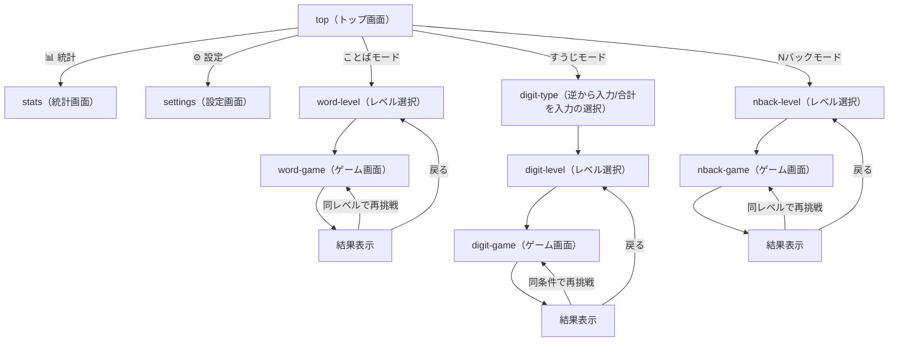

# CLAUDE.md

This file provides guidance to Claude Code (claude.ai/code) when working with code in this repository.

## Overview

**逆復唱トレーニング**（`gyaku-fukushou-app`）は、ワーキングメモリ（作業記憶）を鍛えるトレーニングアプリ。「ことば」「すうじ」「Nバック」の3モードを提供する。UIは日本語のみ。バックエンドを持たないSPAで、全データはブラウザの`localStorage`に保存する。PWA対応でホーム画面に追加してネイティブアプリ風に利用可能。デプロイ先: https://gyaku-fukushou-app.vercel.app/

## Commands

- `npm run dev` — 開発サーバー起動（ポート5174固定、`strictPort: true`）
- `npm run build` — 型チェック（`tsc -b`）後に本番ビルド（`vite build`）
- `npm run lint` — oxlint実行
- `npm run preview` — 本番ビルドのプレビュー
- `npm run test` — Vitestでロジック層のテストを実行（`environment: 'node'`）
- `npm run test:e2e` — Playwrightでブラウザ上のE2Eテストを実行（初回は`npx playwright install --with-deps chromium`が必要）

## Tech stack

| 分類 | 技術 |
|---|---|
| フレームワーク | React 19 + TypeScript |
| ビルドツール | Vite（`@vitejs/plugin-react`） |
| スタイリング | Tailwind CSS v4（`@tailwindcss/vite`、CSS-firstの`@theme`設定。`tailwind.config.js`は存在しない） |
| PWA | vite-plugin-pwa（`registerType: 'autoUpdate'`） |
| テスト | Vitest（`environment: 'node'`、ロジック層のみ対象。UIコンポーネントのテストはなし） |
| Lint | oxlint |
| 状態管理 | Reactの`useState`＋localStorage永続化のみ（外部状態管理ライブラリなし） |

## Screen structure / navigation

`App.tsx`が`View`（Union型）でSPA内の画面状態を管理し、`window.history.pushState`/`popstate`と連動する（ブラウザの戻る操作・PWA化した際のOS標準の戻るボタンにも対応）。



- 各レベル選択・ゲーム画面には「← 戻る」ボタンがある。
- 回答途中で離脱しようとすると`confirmExit`（`window.confirm`）で「回答中のセットが破棄されます。よろしいですか？」の確認ダイアログを表示する。
- 履歴を表示する画面（top / word-level / digit-level / nback-level / stats）に遷移するたびにlocalStorageの履歴を再読み込みする。

## Feature requirements

### ことばモード（`src/lib/reverse.ts`, `src/lib/kana.ts`, `src/lib/phrases.ts`）

- **出題方式**: `PHRASES`（ひらがな表記の単語・文リスト）からレベルごとに重複なくランダムに3問抽出。
- **レベル定義**:
  | レベル | 文字数 | 収録語数 | 復唱の持ち時間 | 一致許容編集距離 |
  |---|---|---|---|---|
  | 1 | 2〜4文字（例: かさ、りんご） | 66語 | 4秒 | 1 |
  | 2 | 4〜6文字（例: ひまわり、とうもろこし） | 68語 | 5秒 | 1 |
  | 3 | 6〜8文字（例: がっこうにいく） | 39語 | 6秒 | 2 |
- **1問の流れ**（`reading → repeat → listening → result`）:
  1. `reading`: 音声合成（Web Speech API）で読み上げ。非対応ブラウザではテキスト表示にフォールバック。
  2. `repeat`: レベル別秒数のカウントダウン中に、逆から声に出して復唱。
  3. `listening`: 音声認識（Web Speech API、`lang: 'ja-JP'`、最大5候補）で聞き取り。タイムアウトはベース4000ms＋文字数×700ms。
  4. `result`: 正誤判定・結果表示。
- **正誤判定**: 期待する答えは文字列をコードポイント単位で反転したもの。認識結果の候補群を正規化（空白・句読点除去＋カタカナ→ひらがな変換）した上でレーベンシュタイン距離が許容値以内なら正解。
- ユーザーが誤判定を手動で反転できる「実際は不正解/正解だった場合はこちら」ボタンあり。認識結果が空の場合は「もう一度録音する」で再収音可能。
- マイクエラー（`not-allowed`, `service-not-allowed`, `audio-capture`）ごとに専用メッセージを表示。
- 音声認識非対応ブラウザでは、レベル選択画面に警告バナーを表示しレベル選択ボタンを無効化。

### すうじモード（`src/lib/digits.ts`）

- ゲームタイプ選択が先にある: 「逆から入力（reverse）」「合計を入力（sum）」の2種類。
- **出題方式**: レベルごとの桁数でランダムな数字列を3問生成。
- **レベル定義**:
  | レベル | 桁数 |
  |---|---|
  | 1 | 3桁 |
  | 2 | 5桁 |
  | 3 | 7桁 |
- **1問の流れ**（`ready → showing → answering → result`）:
  1. `ready`: 1000ms待機
  2. `showing`: 数字を1つずつ表示。1桁あたり表示700ms＋間隔250ms
  3. `answering`: テンキーUI（`NumpadInput`、物理キーボード入力も対応）で回答入力。タイムアウトはベース2000ms＋桁数×2000ms、時間切れで自動採点
  4. `result`: 正誤判定
- **正誤判定**:
  - reverse: 数字配列を逆順に文字列化したものと比較（先頭0埋めの差異は同一視、例: 「325」と「0325」）
  - sum: 数字の合計値の文字列と一致するか

### Nバックモード（`src/lib/nback.ts`）

- **出題方式**: レベルに応じたN値（1back/2back/3back）で、15問の数字系列を生成。N個前と一致する確率は35%で意図的に混入。
- **レベル定義**: レベル1=1つ前と比較、レベル2=2つ前と比較、レベル3=3つ前と比較
- **1試行の流れ**（`ready → showing → result`）:
  - `ready`: 1000ms
  - `showing`: 各数字を1800ms表示＋400ms空白。表示中に「一致」ボタン（またはスペースキー）を押すとその試行を記録
  - 全15試行終了後`result`へ
- **正誤判定**: シグナル検出理論に基づくスコアリング
  - hits（一致で押した）／misses（一致なのに押さなかった）／falseAlarms（不一致なのに押した）／correctRejections（不一致で押さなかった）
  - 正答率 = (hits + correctRejections) / 総試行数 × 100（四捨五入）

### 共通: レベル推奨ロジック（`src/lib/difficulty.ts`）

- 正答率100%以上 → レベルアップ提案（レベル3未満の場合）
- 正答率50%未満 → レベルダウン提案（レベル1超の場合）
- 結果画面（`SetSummary`）に「次のレベルへ挑戦」または「前のレベルに戻る」ボタンとして表示（全3モード共通）

### 実績（アチーブメント）システム（`src/lib/achievements.ts`）

11種類。判定はすべて履歴データから都度動的に計算する（永続化された「解除済みフラグ」は存在しない）。

| アイコン | ラベル | 解除条件 |
|---|---|---|
| 🎉 | はじめの一歩 | 履歴が1件以上 |
| 💯 | パーフェクト | いずれかのセットで全問正解 |
| 🔥 | 3日坊主卒業 | 連続挑戦日数 ≥ 3 |
| 🔥🔥 | 継続は力なり | 連続挑戦日数 ≥ 7 |
| 🔥🔥🔥 | 猛者 | 連続挑戦日数 ≥ 30 |
| 🗣️ | ことば上級者 | ことばモードのレベル3に挑戦履歴あり |
| 🔢 | すうじ上級者 | すうじモードのレベル3に挑戦履歴あり |
| 🧠 | Nバック上級者 | Nバックモードのレベル3に挑戦履歴あり |
| 📈 | 継続力 | 累計セット数 ≥ 10 |
| 🏆 | 継続力（上級） | 累計セット数 ≥ 50 |
| 🌟 | オールラウンダー | word/digit/nback全モードに挑戦履歴あり |

- セット完了直前・直後の履歴を比較し、新規解除された実績を検出する（`getNewlyUnlockedAchievements`）。検出時は効果音＋結果画面に「🎉 新しい実績を獲得しました！」バッジを表示。
- 統計画面では全実績を常時グリッド表示し、未解除は半透明表示。

### 効果音システム（`src/lib/sound.ts`）

Web Audio APIによる完全プログラム生成のシンセサイザー方式（音声ファイルは一切使わない）。

- **共通基盤**:
  - リバーブ: ランダムノイズの減衰インパルス（1.1秒、指数2.5乗の減衰カーブ）から`ConvolverNode`を生成し、軽い残響を一度だけ構築して使い回す
  - 倍音構成とADSR風エンベロープでベル/弦のような音を合成
  - ノイズバッファ＋フィルタでクリック感・打撃音を生成
- **効果音一覧**:
  - 正解音: C6/E6/G6の明るい三和音アルペジオ
  - 不正解音: G3→D3の低め二音下降＋ローパスフィルタのノイズアタック
  - ボタンタップ音: 3000Hz付近のバンドパスノイズの短い（30ms）タップ音
  - レベルアップ音: C5-E5-G5-C6の4音アルペジオ
  - 実績解除音: G5/B5/D6の和音＋高音アクセント
- 設定画面のON/OFFトグルで全音を一括制御。

### 統計・履歴画面（`src/components/StatsScreen.tsx`, `src/lib/history.ts`）

- 4エリア（ことば／すうじ・逆から入力／すうじ・合計／Nバック）×3レベルの正答率
- 苦手分野（正答率最下位）の抽出表示
- 直近N日間の日別正答率推移（未挑戦日はnull扱い）
- 実績一覧グリッド表示

### 設定画面（`src/components/SettingsScreen.tsx`, `src/lib/settings.ts`）

- テーマ（システム／ライト／ダーク）
- 音声合成の声・速度
- 効果音ON/OFF
- 1日の目標セット数

## Data model (localStorage)

すべてのキーと読み書きロジックは`src/lib/history.ts`と`src/lib/settings.ts`に集約されている。新しい永続化データを追加する場合はこの2ファイルを拡張すること。

| キー | 用途 | 形式 |
|---|---|---|
| `gyaku-fukushou:history` | セット完了履歴（最大200件、古い順に切り捨て） | `HistoryEntry[]`のJSON配列 |
| `gyaku-fukushou:settings` | アプリ設定 | `AppSettings`のJSONオブジェクト |

```ts
interface HistoryEntry {
  mode: 'word' | 'digit' | 'nback'
  gameType?: 'reverse' | 'sum'
  level: 1 | 2 | 3
  correct: number
  total: number
  timestamp: string // ISO
}

interface AppSettings {
  themeMode: 'system' | 'light' | 'dark'
  speechRate: number
  voiceURI: string | null
  soundEnabled: boolean
  dailyGoal: number
}
```

デフォルト設定: `{ themeMode: 'system', speechRate: 0.95, voiceURI: null, soundEnabled: true, dailyGoal: 3 }`

読み込み・保存とも`try/catch`でlocalStorage利用不可（プライベートモード等）を許容し、失敗時はデフォルト値やno-opにフォールバックする。

## Non-functional requirements

- **PWA対応**:
  - `name`「逆復唱トレーニング」、`short_name`「逆復唱」、`lang: 'ja'`
  - `theme_color: '#0ea5e9'`、`background_color: '#ffffff'`、`display: 'standalone'`
  - アイコン: 192x192、512x512、maskable 512x512
  - History API連動でOS標準の戻るボタンにも対応
  - `env(safe-area-inset-*)`によるノッチ／セーフエリア対応
- **ダークモード**:
  - Tailwind v4のカスタムバリアントで`.dark`クラスの有無により切替（手動トグル可能）
  - `themeMode`はシステム設定とユーザー選択を解決し、`matchMedia`の変更もリアルタイム追従
- **レスポンシブ対応**: モバイルファースト（`max-w-md`）、`touch-manipulation`でタップ操作最適化
- **音声認識・音声合成のブラウザ対応**:
  - 音声認識: Chrome/Edge系のベンダープレフィックス対応、非対応時は機能を無効化して警告表示
  - 音声合成: 非対応時はテキスト表示にフォールバック
  - 日本語音声（`lang: 'ja-JP'`）を優先選択

## Testing

- **ユニットテスト（Vitest）**: `src/lib/`配下にロジック層のテストを併置している（UIコンポーネントの単体テストはなし）:
  `reverse.test.ts` / `digits.test.ts` / `kana.test.ts` / `difficulty.test.ts` / `theme.test.ts` / `history.test.ts` / `nback.test.ts` / `achievements.test.ts` / `logger.test.ts`
  新しいロジックを`src/lib/`に追加する場合は、同ディレクトリに`*.test.ts`を併置してVitestでカバーすること。`vitest.config.ts`で`e2e/`ディレクトリは除外している。
- **E2Eテスト（Playwright）**: `e2e/`配下に主要な画面遷移・操作フローのスモークテストを配置している（`playwright.config.ts`、本番ビルドを`vite preview`で配信して実行）。新しい画面や主要フローを追加した場合は、ここにスモークテストを追加することを検討する。

## Error handling / logging

React描画時の例外は`src/components/ErrorBoundary.tsx`で捕捉し、`window.onerror`/`unhandledrejection`は`src/lib/logger.ts`の`installGlobalErrorHandlers`（`main.tsx`で起動時に登録）で捕捉する。バックエンドを持たないため外部監視サービスへの送信は行わず、`console.error`への構造化ログ出力とメモリ上への直近件数の保持のみ。詳細は[ERROR_HANDLING.md](ERROR_HANDLING.md)を参照。

## See also

- [README.md](README.md) — ユーザー向けの簡潔な概要
- [ROADMAP.md](ROADMAP.md) — 今後の開発候補・バックログ
- [CHANGELOG.md](CHANGELOG.md) — バージョンごとの変更履歴
- [ACCESSIBILITY.md](ACCESSIBILITY.md) — アクセシビリティ方針
- [PRIVACY.md](PRIVACY.md) — プライバシーポリシー
- [ERROR_HANDLING.md](ERROR_HANDLING.md) — エラー監視・ロギング方針
- [DEPLOYMENT.md](DEPLOYMENT.md) — デプロイ手順
