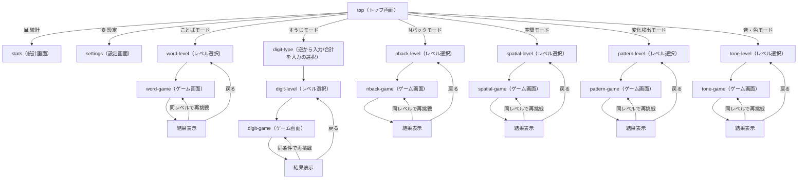

# CLAUDE.md

This file provides guidance to Claude Code (claude.ai/code) when working with code in this repository.

## Overview

**逆復唱トレーニング**（`gyaku-fukushou-app`）は、ワーキングメモリ（作業記憶）を鍛えるトレーニングアプリ。「ことば」「すうじ」「Nバック」「空間」「変化検出」「音・色」の6モードを提供する。UIは日本語のみ。トレーニング機能自体はバックエンドを持たないSPAで、全データはブラウザの`localStorage`に保存する。**例外として、オプトインの「リマインド通知」機能のみ、Vercel Serverless Functions + Redisストレージを使う最小限のバックエンドを持つ**（詳細は「プッシュ通知リマインダー」セクションを参照）。PWA対応でホーム画面に追加してネイティブアプリ風に利用可能。デプロイ先: https://gyaku-fukushou-app.vercel.app/

## 応答言語

Claude Codeがこのリポジトリで作業する際の、ツール呼び出し前後に表示する一言コメント・進捗報告・要約・最終レポートなど、ユーザーに見えるテキストはすべて日本語で書くこと。英語のまま出力してよいのは、コード自体・コミットメッセージ中のコード識別子・エラーメッセージの引用など、日本語に訳すと不自然または不正確になるものに限る。

## Commands

- `npm run dev` — 開発サーバー起動（ポート5174固定、`strictPort: true`）
- `npm run build` — 型チェック（`tsc -b`）後に本番ビルド（`vite build`）
- `npm run lint` — oxlint実行
- `npm run preview` — 本番ビルドのプレビュー
- `npm run test` — Vitestでロジック層のテストを実行（`environment: 'node'`）
- `npm run test:e2e` — Playwrightでブラウザ上のE2Eテストを実行（初回は`npx playwright install --with-deps chromium`が必要）

## Tech stack

| 分類 | 技術 |
|---|---|
| フレームワーク | React 19 + TypeScript |
| ビルドツール | Vite（`@vitejs/plugin-react`） |
| スタイリング | Tailwind CSS v4（`@tailwindcss/vite`、CSS-firstの`@theme`設定。`tailwind.config.js`は存在しない） |
| PWA | vite-plugin-pwa（`registerType: 'autoUpdate'`） |
| テスト | Vitest（`environment: 'node'`、ロジック層のみ対象。UIコンポーネントのテストはなし） |
| Lint | oxlint |
| 状態管理 | Reactの`useState`＋localStorage永続化のみ（外部状態管理ライブラリなし） |
| バックエンド（通知機能のみ） | Vercel Serverless Functions（`api/`配下、Node.jsランタイム）＋ Redisストレージ（`@upstash/redis`、Vercel経由）＋ Vercel Cron |

## Screen structure / navigation

`App.tsx`が`View`（Union型）でSPA内の画面状態を管理し、`window.history.pushState`/`popstate`と連動する（ブラウザの戻る操作・PWA化した際のOS標準の戻るボタンにも対応）。



- 各レベル選択・ゲーム画面には「← 戻る」ボタンがある。
- 回答途中で離脱しようとすると`confirmExit`（`window.confirm`）で「回答中のセットが破棄されます。よろしいですか？」の確認ダイアログを表示する。
- 履歴を表示する画面（top / word-level / digit-level / nback-level / spatial-level / pattern-level / tone-level / stats）に遷移するたびにlocalStorageの履歴を再読み込みする。

## Feature requirements

### ことばモード（`src/lib/reverse.ts`, `src/lib/kana.ts`, `src/lib/phrases.ts`）

- **出題方式**: `PHRASES`（ひらがな表記の単語・文リスト）からレベルごとに重複なくランダムに3問抽出。
- **レベル定義**:
  | レベル | 文字数 | 収録語数 | 復唱の持ち時間 | 一致許容編集距離 |
  |---|---|---|---|---|
  | 1 | 2〜4文字（例: かさ、りんご） | 66語 | 4秒 | 1 |
  | 2 | 4〜6文字（例: ひまわり、とうもろこし） | 68語 | 5秒 | 1 |
  | 3 | 6〜8文字（例: がっこうにいく） | 39語 | 6秒 | 2 |
- **1問の流れ**（`reading → repeat → listening → result`）:
  1. `reading`: 音声合成（Web Speech API）で読み上げ。非対応ブラウザではテキスト表示にフォールバック。
  2. `repeat`: レベル別秒数のカウントダウン中に、逆から声に出して復唱。
  3. `listening`: 音声認識（Web Speech API、`lang: 'ja-JP'`、最大5候補）で聞き取り。タイムアウトはベース4000ms＋文字数×700ms。
  4. `result`: 正誤判定・結果表示。
- **正誤判定**: 期待する答えは文字列をコードポイント単位で反転したもの。認識結果の候補群を正規化（空白・句読点除去＋カタカナ→ひらがな変換）した上でレーベンシュタイン距離が許容値以内なら正解。
- ユーザーが誤判定を手動で反転できる「実際は不正解/正解だった場合はこちら」ボタンあり。認識結果が空の場合は「もう一度録音する」で再収音可能。
- マイクエラー（`not-allowed`, `service-not-allowed`, `audio-capture`）ごとに専用メッセージを表示。
- 音声認識非対応ブラウザでは、レベル選択画面に警告バナーを表示しレベル選択ボタンを無効化。

### すうじモード（`src/lib/digits.ts`）

- ゲームタイプ選択が先にある: 「逆から入力（reverse）」「合計を入力（sum）」の2種類。
- **出題方式**: レベルごとの桁数でランダムな数字列を3問生成。
- **レベル定義**:
  | レベル | 桁数 |
  |---|---|
  | 1 | 3桁 |
  | 2 | 5桁 |
  | 3 | 7桁 |
- **1問の流れ**（`ready → showing → answering → result`）:
  1. `ready`: 1000ms待機
  2. `showing`: 数字を1つずつ表示。1桁あたり表示700ms＋間隔250ms
  3. `answering`: テンキーUI（`NumpadInput`、物理キーボード入力も対応）で回答入力。タイムアウトはベース2000ms＋桁数×2000ms、時間切れで自動採点
  4. `result`: 正誤判定
- **正誤判定**:
  - reverse: 数字配列を逆順に文字列化したものと比較（先頭0埋めの差異は同一視、例: 「325」と「0325」）
  - sum: 数字の合計値の文字列と一致するか

### Nバックモード（`src/lib/nback.ts`）

- **出題方式**: レベルに応じたN値（1back/2back/3back）で、15問の数字系列を生成。N個前と一致する確率は35%で意図的に混入。
- **レベル定義**: レベル1=1つ前と比較、レベル2=2つ前と比較、レベル3=3つ前と比較
- **1試行の流れ**（`ready → showing → result`）:
  - `ready`: 1000ms
  - `showing`: 各数字を1800ms表示＋400ms空白。表示中に「一致」ボタン（またはスペースキー）を押すとその試行を記録
  - 全15試行終了後`result`へ
- **正誤判定**: シグナル検出理論に基づくスコアリング
  - hits（一致で押した）／misses（一致なのに押さなかった）／falseAlarms（不一致なのに押した）／correctRejections（不一致で押さなかった）
  - 正答率 = (hits + correctRejections) / 総試行数 × 100（四捨五入）

### 空間モード（`src/lib/spatial.ts`）

視空間ワーキングメモリ（Corsi Block-Tapping Taskを参考）を鍛えるモード。マスが順番に光るのを見て覚え、逆の順番でタップして答える。

- **出題方式**: レベルごとのグリッドサイズから、重複なくランダムにマスを選んで系列を生成し、3問1セットで出題。
- **レベル定義**:
  | レベル | グリッド | マス数 |
  |---|---|---|
  | 1 | 3×3 | 3 |
  | 2 | 3×3 | 4 |
  | 3 | 4×4 | 5 |
- **1問の流れ**（`ready → showing → answering → result`）:
  1. `ready`: 1000ms待機
  2. `showing`: マスを1つずつ光らせる。1マスあたり表示700ms＋間隔250ms
  3. `answering`: グリッドを逆の順番でタップして回答。タップ済みマスには順番の数字を表示。タイムアウトはベース3000ms＋マス数×2000ms、時間切れで自動採点
  4. `result`: 正誤判定
- **正誤判定**: タップした順序が、出題系列を逆順にしたものと完全一致するか。

### 変化検出モード（`src/lib/pattern.ts`）

視覚パターン記憶（Luck & Vogel 1997の変化検出課題を参考）を鍛えるモード。一瞬表示される模様を覚え、再表示時に変化しているかを判定する。

- **出題方式**: レベルごとのグリッドサイズ・塗りつぶしマス数でランダムな模様を生成。50%の確率で、塗りつぶしマスのうち1つを別の空きマスへ移動させた「変化あり」の比較用模様を生成する。3問1セットで出題。
- **レベル定義**:
  | レベル | グリッド | 塗りつぶしマス数 |
  |---|---|---|
  | 1 | 4×4 | 4 |
  | 2 | 4×4 | 6 |
  | 3 | 5×5 | 8 |
- **1問の流れ**（`ready → showing → answering → result`）:
  1. `ready`: 1000ms待機
  2. `showing`: 模様を3000ms表示→500ms空白
  3. `answering`: 比較用の模様を表示し続けながら「変化あり」「変化なし」の2択で回答（Y/N・矢印キーにも対応）。タイムアウトはベース4000ms＋塗りつぶしマス数×400ms、時間切れは「変化なし」として自動採点
  4. `result`: 正誤判定
- **正誤判定**: 回答（変化あり/なし）が実際の`hasChange`と一致するか。

### 音・色モード（`src/lib/tone.ts`）

非言語性の聴覚ワーキングメモリ（ピッチ記憶が言語・数字の記憶と独立した貯蔵系であることを示すDeutsch 1970などの知見を参考）を鍛える、Simon型のモード。4色のパッドが音とともに光る順番を覚え、同じ順にタップして再現する。

- **出題方式**: レベルごとの長さで、4色のパッド番号（重複可）をランダムに並べた系列を生成。3問1セットで出題。
- **レベル定義**:
  | レベル | 音数 |
  |---|---|
  | 1 | 3 |
  | 2 | 4 |
  | 3 | 5 |
- **1問の流れ**（`ready → showing → answering → result`）:
  1. `ready`: 1000ms待機
  2. `showing`: パッドを1つずつ光らせ、`playPadTone`（Web Audio API、パッドごとに異なる音高）で音を鳴らす。1パッドあたり表示600ms＋間隔300ms
  3. `answering`: 4色のパッドを同じ順にタップして回答。タイムアウトはベース3000ms＋音数×2000ms、時間切れで自動採点
  4. `result`: 正誤判定
- **正誤判定**: タップした順序が出題系列と完全一致するか。

### 共通: レベル推奨ロジック（`src/lib/difficulty.ts`）

- 正答率100%以上 → レベルアップ提案（レベル3未満の場合）
- 正答率50%未満 → レベルダウン提案（レベル1超の場合）
- 結果画面（`SetSummary`）に「次のレベルへ挑戦」または「前のレベルに戻る」ボタンとして表示（全モード共通）

### 実績（アチーブメント）システム（`src/lib/achievements.ts`）

14種類。判定はすべて履歴データから都度動的に計算する（永続化された「解除済みフラグ」は存在しない）。

| アイコン | ラベル | 解除条件 |
|---|---|---|
| 🎉 | はじめの一歩 | 履歴が1件以上 |
| 💯 | パーフェクト | いずれかのセットで全問正解 |
| 🔥 | 3日坊主卒業 | 連続挑戦日数 ≥ 3 |
| 🔥🔥 | 継続は力なり | 連続挑戦日数 ≥ 7 |
| 🔥🔥🔥 | 猛者 | 連続挑戦日数 ≥ 30 |
| 🗣️ | ことば上級者 | ことばモードのレベル3に挑戦履歴あり |
| 🔢 | すうじ上級者 | すうじモードのレベル3に挑戦履歴あり |
| 🧠 | Nバック上級者 | Nバックモードのレベル3に挑戦履歴あり |
| 🧩 | 空間記憶上級者 | 空間モードのレベル3に挑戦履歴あり |
| 👀 | 観察力上級者 | 変化検出モードのレベル3に挑戦履歴あり |
| 🎵 | 音感上級者 | 音・色モードのレベル3に挑戦履歴あり |
| 📈 | 継続力 | 累計セット数 ≥ 10 |
| 🏆 | 継続力（上級） | 累計セット数 ≥ 50 |
| 🌟 | オールラウンダー | word/digit/nback（従来3モード）に挑戦履歴あり（後方互換のため対象は変更していない） |
| 🌈 | 全モード制覇 | 全6モードに挑戦履歴あり |

- セット完了直前・直後の履歴を比較し、新規解除された実績を検出する（`getNewlyUnlockedAchievements`）。検出時は効果音＋結果画面に「🎉 新しい実績を獲得しました！」バッジを表示。
- 統計画面では全実績を常時グリッド表示し、未解除は半透明表示。

### 週間振り返りカード（`src/lib/recap.ts`）

トップ画面（`TopScreen`）に表示する、継続利用率向上のための動機付け施策。直近に完了した週（月曜〜日曜）のセット数・正答率を集計し、前々週のセット数と比較したメッセージ（増加/減少/同数）を添えて表示する（`getWeeklyRecap`）。

- その週に1件も記録がなければ何も表示しない（振り返る内容がないため）。
- 週が変わるたびに1回だけ表示する。表示済みの週キーは`localStorage`（`gyaku-fukushou:lastRecapWeekKey`）に保存し、閉じる操作（`markRecapShown`）で更新する。
- SNSシェア（「結果をシェア」機能）と相性の良い訴求内容を意図して設計。

### サプライズ演出（`src/lib/luckyBonus.ts`）

実績のような「達成すれば必ずもらえる」確定報酬とは別に、結果画面（SetSummary）表示のたびに12%の確率で「🍀 ラッキーデー！」バッジを表示する完全にランダムな演出（`rollLuckyBonus`）。実績・統計・レベル判定など、いかなる評価軸にも一切影響しない飾りの演出として意図的に設計しており、実績システムの価値を損なわない。SetSummaryのマウント時に1回だけ判定し、以降の再描画では再抽選しない。

### 効果音システム（`src/lib/sound.ts`）

Web Audio APIによる完全プログラム生成のシンセサイザー方式（音声ファイルは一切使わない）。

- **共通基盤**:
  - リバーブ: ランダムノイズの減衰インパルス（1.1秒、指数2.5乗の減衰カーブ）から`ConvolverNode`を生成し、軽い残響を一度だけ構築して使い回す
  - 倍音構成とADSR風エンベロープでベル/弦のような音を合成
  - ノイズバッファ＋フィルタでクリック感・打撃音を生成
- **効果音一覧**:
  - 正解音: C6/E6/G6の明るい三和音アルペジオ
  - 不正解音: G3→D3の低め二音下降＋ローパスフィルタのノイズアタック
  - ボタンタップ音: 3000Hz付近のバンドパスノイズの短い（30ms）タップ音
  - レベルアップ音: C5-E5-G5-C6の4音アルペジオ
  - 実績解除音: G5/B5/D6の和音＋高音アクセント
- 設定画面のON/OFFトグルで全音を一括制御。

### 統計・履歴画面（`src/components/StatsScreen.tsx`, `src/lib/history.ts`）

- 4エリア（ことば／すうじ・逆から入力／すうじ・合計／Nバック）×3レベルの正答率
- 苦手分野（正答率最下位）の抽出表示
- 直近N日間の日別正答率推移（未挑戦日はnull扱い）
- 実績一覧グリッド表示

### 設定画面（`src/components/SettingsScreen.tsx`＋セクションごとの`src/components/Settings*Section.tsx`, `src/lib/settings.ts`）

`SettingsScreen.tsx`は設定state（`AppSettings`）の保持と各セクションへのprops受け渡しのみを担い、実際のUIと操作ロジックはテーマ／音声／目標セット数／効果音／通知／データの6セクションコンポーネントに分割している（`SettingsThemeSection`, `SettingsVoiceSection`, `SettingsDailyGoalSection`, `SettingsSoundSection`, `SettingsNotificationSection`, `SettingsDataSection`）。通知・データの各セクションは購読状態やインポート/エクスポートのローカルUI状態を自身で保持する。

- テーマ（システム／ライト／ダーク）
- 音声合成の声・速度
- 効果音ON/OFF
- 1日の目標セット数
- リマインド通知（後述）

### プッシュ通知リマインダー（`src/lib/push.ts`, `src/lib/reminder.ts`, `src/sw.ts`, `api/`配下）

継続利用率向上のための、既定オフのオプトイン機能。その日1回もプレイしていないユーザーに、毎日21時ごろ（JST）プッシュ通知でリマインドする。この機能のみ、アプリ全体の「バックエンドを持たないSPA」という方針の例外として最小限のサーバーサイド機構を持つ。

- 送信時刻はVercel Cron（Hobbyプランは1日1回までしか実行できない制約）により**全ユーザー共通の固定時刻**（`vercel.json`で設定、実行は指定時刻から最大59分前後する）。ユーザーごとに時刻を選べる設計ではない
- **クライアント側** (`src/lib/push.ts`):
  - `isPushSupported()`: `PushManager`/`Notification`/`VITE_VAPID_PUBLIC_KEY`の有無に加え、iOSは`display-mode: standalone`（ホーム画面追加済み）でない場合は非対応として扱う
  - `subscribeToPush()`: 通知許可ダイアログ→`pushManager.subscribe`→`POST /api/push/subscribe`
  - `unsubscribeFromPush()`: `POST /api/push/unsubscribe`
  - `syncPushState()`: 各モードのGameScreenが1セット完了時（`appendHistoryEntry`直後）に呼び、購読中であれば「今日プレイした」ことを`POST /api/push/sync`でサーバーへ同期する
- **Service Worker** (`src/sw.ts`): `vite-plugin-pwa`を`generateSW`から`injectManifest`戦略に切替え、`push`/`notificationclick`イベントを独自ハンドリング（型チェックはDOM libと衝突するため`tsconfig.sw.json`を独立させている）
- **サーバー側** (`api/`配下、Node.js Serverless Functions、`tsconfig.api.json`で型チェック):
  - `api/_lib/kv.ts`: ストレージ抽象化（内部で`@upstash/redis`を使用。プロバイダ変更時はこの1ファイルのみ差し替える）
  - `api/_lib/reminder.ts`: `src/lib/reminder.ts`の複製（判定・メッセージ生成ロジック。ビルド設定を独立させるため意図的に複製している。**変更時は両方を更新すること**）
  - `api/push/subscribe.ts` / `sync.ts` / `unsubscribe.ts`: 購読の作成・同期・削除
  - `api/cron/reminder.ts`: `vercel.json`のVercel Cron（1日1回）から呼ばれ、`CRON_SECRET`で認証。各購読者について「今日未プレイ」かつ「今日未送信」なら送信し、期限切れ購読（404/410）は削除する
- **送信条件**: 今日1回もプレイしていない場合にのみ送信（目標セット数への到達有無は問わない）。二重送信防止のため送信済み日付も記録する
- **必要な環境変数**: `VITE_VAPID_PUBLIC_KEY`（クライアント、ビルド時埋め込み）、`VAPID_PUBLIC_KEY`／`VAPID_PRIVATE_KEY`／`VAPID_SUBJECT`（サーバー、`web-push`用）、`CRON_SECRET`（Cron認証）、Redis接続用の環境変数（Vercel連携時に自動付与）。セットアップ手順は[DEPLOYMENT.md](DEPLOYMENT.md)を参照
- VAPID公開鍵が未設定（ビルド時に`VITE_VAPID_PUBLIC_KEY`が空）の場合、`isPushSupported()`が`false`を返し設定画面には非対応メッセージが表示される（機能自体は壊れない）

## Data model (localStorage)

すべてのキーと読み書きロジックは`src/lib/history.ts`と`src/lib/settings.ts`に集約されている。新しい永続化データを追加する場合はこの2ファイルを拡張すること。

| キー | 用途 | 形式 |
|---|---|---|
| `gyaku-fukushou:history` | セット完了履歴（最大200件、古い順に切り捨て） | `HistoryEntry[]`のJSON配列 |
| `gyaku-fukushou:settings` | アプリ設定 | `AppSettings`のJSONオブジェクト |
| `gyaku-fukushou:lastRecapWeekKey` | 週間振り返りカードの表示済み週（[週間振り返りカード](#週間振り返りカードsrclibrecapts)参照。読み書きは`src/lib/recap.ts`が単独で担い、上記2ファイルには集約していない） | 週の月曜日を表す日付キー文字列 |

```ts
interface HistoryEntry {
  mode: 'word' | 'digit' | 'nback' | 'spatial' | 'pattern' | 'tone'
  gameType?: 'reverse' | 'sum'
  level: 1 | 2 | 3
  correct: number
  total: number
  timestamp: string // ISO
}

interface AppSettings {
  themeMode: 'system' | 'light' | 'dark'
  speechRate: number
  voiceURI: string | null
  soundEnabled: boolean
  dailyGoal: number
  notificationsEnabled: boolean
}
```

デフォルト設定: `{ themeMode: 'system', speechRate: 0.95, voiceURI: null, soundEnabled: true, dailyGoal: 3, notificationsEnabled: false }`

読み込み・保存とも`try/catch`でlocalStorage利用不可（プライベートモード等）を許容し、失敗時はデフォルト値やno-opにフォールバックする。

`notificationsEnabled`はローカル設定であり、実際のプッシュ購読状態はサーバー側（Redisストレージ）が真実の情報源。両者がズレた場合（例: 別端末で解除した等）、次回`syncPushState()`やトグル操作時に自然に収束する設計だが、厳密な整合性は保証していない。

## Non-functional requirements

- **PWA対応**:
  - `name`「逆復唱トレーニング」、`short_name`「逆復唱」、`lang: 'ja'`
  - `theme_color: '#0ea5e9'`、`background_color: '#ffffff'`、`display: 'standalone'`
  - アイコン: 192x192、512x512、maskable 512x512
  - History API連動でOS標準の戻るボタンにも対応
  - `env(safe-area-inset-*)`によるノッチ／セーフエリア対応
- **ダークモード**:
  - Tailwind v4のカスタムバリアントで`.dark`クラスの有無により切替（手動トグル可能）
  - `themeMode`はシステム設定とユーザー選択を解決し、`matchMedia`の変更もリアルタイム追従
- **レスポンシブ対応**: モバイルファースト（`max-w-md`）、`touch-manipulation`でタップ操作最適化
- **音声認識・音声合成のブラウザ対応**:
  - 音声認識: Chrome/Edge系のベンダープレフィックス対応、非対応時は機能を無効化して警告表示
  - 音声合成: 非対応時はテキスト表示にフォールバック
  - 日本語音声（`lang: 'ja-JP'`）を優先選択

## Testing

- **ユニットテスト（Vitest）**: `src/lib/`配下にロジック層のテストを併置している（UIコンポーネントの単体テストはなし）:
  `reverse.test.ts` / `digits.test.ts` / `kana.test.ts` / `difficulty.test.ts` / `theme.test.ts` / `history.test.ts` / `nback.test.ts` / `achievements.test.ts` / `logger.test.ts` / `backup.test.ts` / `spatial.test.ts` / `pattern.test.ts` / `tone.test.ts` / `reminder.test.ts`

  加えて`api/_lib/reminder.ts`（`src/lib/reminder.ts`の複製）にも同期確認用の軽量テスト`api/_lib/reminder.test.ts`がある。
  新しいロジックを`src/lib/`に追加する場合は、同ディレクトリに`*.test.ts`を併置してVitestでカバーすること。`vitest.config.ts`で`e2e/`ディレクトリは除外している。
- **E2Eテスト（Playwright）**: `e2e/`配下に主要な画面遷移・操作フローのスモークテストを配置している（`playwright.config.ts`、本番ビルドを`vite preview`で配信して実行）。新しい画面や主要フローを追加した場合は、ここにスモークテストを追加することを検討する。
- **アクセシビリティ自動検証（axe-core）**: `@axe-core/playwright`を用いた`e2e/accessibility.spec.ts`で、主要画面についてWCAG AA準拠を自動チェックする。新しい画面を追加した場合はここに対象を追加することを検討する。詳細は[ACCESSIBILITY.md](ACCESSIBILITY.md)を参照。

## Error handling / logging

React描画時の例外は`src/components/ErrorBoundary.tsx`で捕捉し、`window.onerror`/`unhandledrejection`は`src/lib/logger.ts`の`installGlobalErrorHandlers`（`main.tsx`で起動時に登録）で捕捉する。バックエンドを持たないため外部監視サービスへの送信は行わず、`console.error`への構造化ログ出力とメモリ上への直近件数の保持のみ。詳細は[ERROR_HANDLING.md](ERROR_HANDLING.md)を参照。

## 開発サイクル（自走改善時の運用ルール）

1. **分析**: ROADMAP.mdの「候補」欄から次の1件を選ぶ。なければ新規に改善案を提案してから着手する。既存コード・設計・CHANGELOG.md/ROADMAP.mdの完了履歴も参照し、重複や矛盾がないか確認する。
2. **実装**: 新機能または改善を実装する。1サイクルの粒度は「動作する状態を保ったまま完結する1つの変更」を目安にする。大きな機能（新モード追加など）は「型定義→ロジック→UI→ナビゲーション統合」のようにサブサイクルへ分割し、サブサイクルごとにコミットしてよい。
3. **検証**: 以下を順に実施する。
   - `npm run verify`（`build`→`lint`→`test`を一括実行。新規ロジックには`src/lib/`に`*.test.ts`を併置）
   - 影響範囲のE2E（`npm run test:e2e -- <対象spec>`）。新しい画面・主要フローを追加した場合は`e2e/`にスモークテストを追加する
   - タイマー/アニメーションを伴うUIは、対話的なブラウザ確認より実プロセス内タイマーで動くE2Eの方が正確。ブラウザでの確認は補助的な位置づけとする
4. **コミット**: 検証が通った状態でコミットする（ビルド可能な状態を維持）。
5. **CHANGELOG.md更新**: `[Unreleased]`セクションに変更内容を追記する。
6. **ROADMAP.md更新**: 完了項目を「候補」→「完了」へ移動し、日付を付す。新たに見つかった改善案があれば「候補」に追加する。
7. **次のサイクルへ**: 1〜6を繰り返す。

### push・デプロイのタイミング

コミットまでを1サイクルの範囲とし、`git push`（Vercelへの自動デプロイのトリガーになる）は都度ユーザーに確認してから行う。複数サイクル分をまとめて1回のpushにするかは、ユーザーの指示に従う。

### 新モード・新画面を追加する際に触るべきファイル

新しいトレーニングモードを追加する場合、以下が影響範囲になりやすい（実装時のチェックリスト）:

- `src/types.ts`: `Mode`型の拡張、出題/結果の型定義
- `src/lib/<mode>.ts`＋`<mode>.test.ts`: 出題生成・正誤判定ロジック
- `src/lib/history.ts`: `ALL_AREAS`への追加（統計集計対象になる）
- `src/lib/achievements.ts`: レベル3到達実績などの追加検討
- `src/components/<Mode>LevelSelect.tsx` / `<Mode>GameScreen.tsx`: 画面実装
- `src/components/StatsScreen.tsx` / `TopScreen.tsx`: `AREA_LABELS`などのラベル追加
- `src/App.tsx`: `View`型・`goTo`の履歴再読み込み条件・ルーティングのcase分岐
- `e2e/`: 主要導線のスモークテスト
- CLAUDE.md（本ファイル）: Screen structure図・Feature requirements・実績一覧・データモデルの反映

### 設計ドキュメント（CLAUDE.md）反映のタイミング

CHANGELOG.md/ROADMAP.mdは毎サイクル更新するが、CLAUDE.mdのような設計ドキュメントは複数サイクルにまたがる開発の完了後にまとめて反映してよい（開発途中の頻繁な書き換えによるノイズを避けるため）。ただしユーザーから都度反映の指示があればそれに従う。

## See also

- [README.md](README.md) — ユーザー向けの簡潔な概要
- [ROADMAP.md](ROADMAP.md) — 今後の開発候補・バックログ
- [CHANGELOG.md](CHANGELOG.md) — バージョンごとの変更履歴
- [ACCESSIBILITY.md](ACCESSIBILITY.md) — アクセシビリティ方針
- [PRIVACY.md](PRIVACY.md) — プライバシーポリシー（リポジトリ用。公開URLは`/privacy.html`＝`public/privacy.html`、ストア審査等でJS起動なしに直接開ける静的ページ。アプリ内には設定画面から遷移できる要約画面もある）
- [ERROR_HANDLING.md](ERROR_HANDLING.md) — エラー監視・ロギング方針
- [DEPLOYMENT.md](DEPLOYMENT.md) — デプロイ手順
